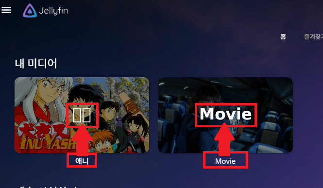

# Internationalisation and Localisation

!!! info "This page describes how 'languages' and localisation are planned to be implemented in Reloaded."

Internationalisation and Localisation, referred to as `i18n` and `l10n` onwards,
describe the process of adapting our code to be locale agnostic.

## Additional Details

`i18n` and `l10n` encompass many things:

- Numbers.
- Date and time.
- Currencies.
- Text layouts.

!!! info "English is left-to-right and top-to-bottom horizontally..."

    But some other languages read from right-to-left and some even vertically.

### Text Length

!!! warning "Text can vary in length between languages."

If a button has a text of length `10` in English, it might only contain two characters in
Japanese or `20` in German.

The UI must be designed to adapt to drastic changes in length, to avoid text cutoff, or undesired
wrapping.

### Fonts

!!! warning "Fonts don't always support all characters."

Most fonts out there only support a limited amount of characters, typically based on Roman alphabet.

CJK fonts (**C**hinese, **J**apanese, and **K**orean), like [Noto by Google][noto-google], are
special fonts that contain a vast amount of characters from more parts of the world.

Reloaded3 must ship an international fallback font, such that if a character is not supported
by the main font, it can still be rendered.

<figure markdown="span">
  
  <figcaption>Example: Missing Korean Font in Jellyfin</figcaption>
</figure>

## Requirements

!!! info "These are the requirements for supporting localization in Reloaded3."

- Support Common Languages (EN, JP, FR) etc.
- Make Editing Translations Easy
- Lightweight on Resources
    - Make use of compile time logic if possible.
    - Ideally less than 10kB code.
- Must be Consistent Cross Languages
    - At least C# & Rust
- Provide 3rd Party Translations
    - An external mod may provide translations for an existing mod.
    - This way, the original mod author does not need to worry about translations.

### Non-Requirements

- Support for Right-to-Left languages (RTL) and vertical languages.
    - Creating multiple UI designs is too much...
- Fully supporting `l10n` in all parts of Reloaded.
    - Mod loader logs may prefer to display a standardized language to help debugging.

[noto-google]: https://fonts.google.com/noto