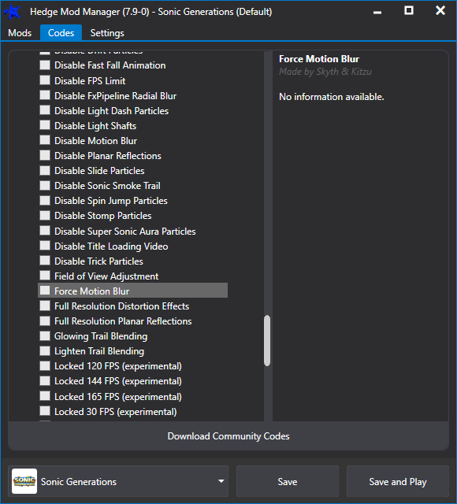

# FAQ

## My mod manager implements game specific functionality. How can I migrate this to R3?

!!! tip

    Port the runtime functionality to a Reloaded3 Mod.  
    Then simply import/export a mod config when you load/save from the Manager.  

We will use HedgeModManager's `Codes` system as an example.

HedgeModManager has a codes system that allows users to write [short scripts](https://github.com/thesupersonic16/HedgeModManager/blob/rewrite/HedgeModManager/Resources/Codesv2/SonicGenerations.hmm)
using C# which modify game behaviour. This is intended for 1 liners for which writing a full mod would be overkill.

In HMM when the game is ran, the loader loads the .NET (Framework) runtime, pastes the enabled codes and compiles them using 
Roslyn, the C# compiler. The logic to load the framework and start code compilation is directly tied to the mod loader.

To cleanly port this to Reloaded3, you would:  

- Wrap the Codes Compiler in a Reloaded3 Mod.  
- Export enabled Codes as Codes Compiler Mod Configuration.  
- Have Mod Manager Auto-Enable Codes Compiler Mod if any Codes Enabled.  

It is not as much work as you think 😉.

With those changes, now:

- Everyone can now use `HedgeModManager`'s code system with any game.  
- The user experience for `HedgeModManager` users is unchanged.  

!!! note

    Of course this is only an example; circumstances may be different depending on feature.

## My game requires that mods are merged.

nya~