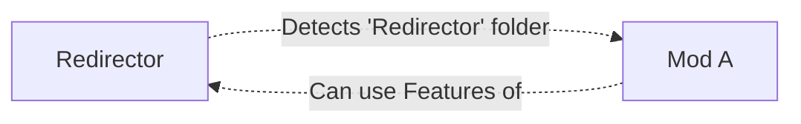
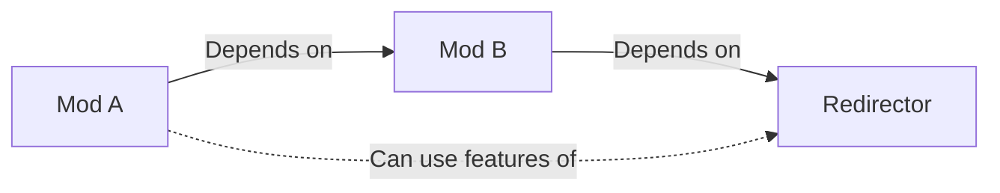

# Changes to Mod Ideology

!!! info "Heads up!"

    This page outlines important changes to how mods should be structured in Reloaded3, which
    differ from the practices followed in most `Reloaded-II` mods.

## Explicit Dependencies

!!! warning "Important Change"

    Mods now require a direct or transitive dependency to use the features of another mod.

### Previous Approach

In Reloaded-II, most mods would blindly accept custom data based on the presence of specific folders,
without explicitly declaring dependencies on the mods providing those features.

Consider the following scenario:

In this case, any mod (Mod A) that included a folder named `Redirector` would be automatically
accepted by the `Reloaded File Redirector` mod, regardless of whether Mod A explicitly declared a
dependency on it.

!!! note

    This was the approach used by many Reloaded-II mods, because chances are, some other mod would
    enable the correct dependency. However, unfortunately that's not always the case.

    In R2, there was no 'diagnostics' system, so there was no easy way to inform the mod author of
    their mistake(s).

### New Approach

!!! success "New Approach in Reloaded3"

    In Reloaded3, mods must explicitly declare a dependency on the mods they rely on to use their features.

Using the same example, the new approach would look like this:

Now, for Mod A to use the features provided by `Reloaded File Redirector`, it ***must*** explicitly
declare a dependency on it. Mods should ignore other mods which don't.

!!! tip "Transitive Dependencies"

    Reloaded3 also supports transitive dependencies, which means that if Mod A depends on Mod B, and
    Mod B depends on Mod C, then Mod A can use the features of Mod C without explicitly declaring a
    dependency on it.

Here's an example of transitive dependencies:

In this case, Mod A can use the features of Mod C indirectly through its dependency on Mod B.

### Benefits of Explicit Dependencies

- Clearer understanding of mod relationships and dependencies.
- Improved dependency resolution.
    - People can't ship mods with missing dependencies anymore.
- Potentially removes false positives.