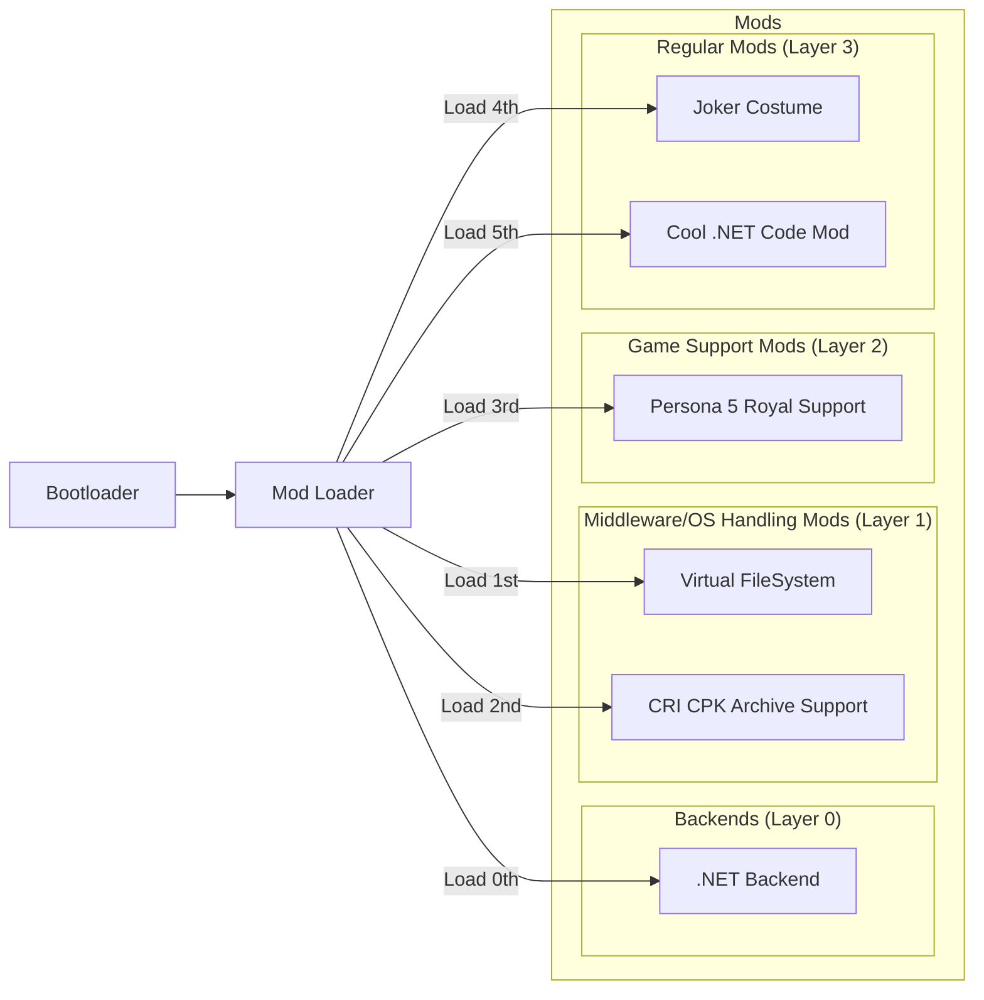
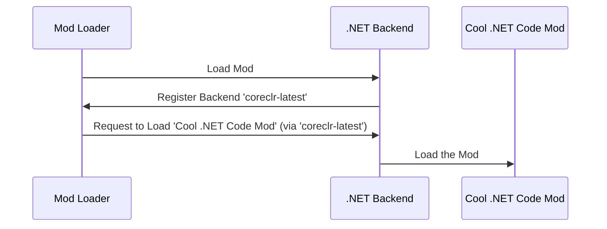
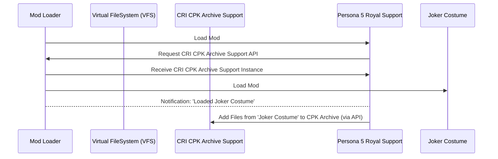
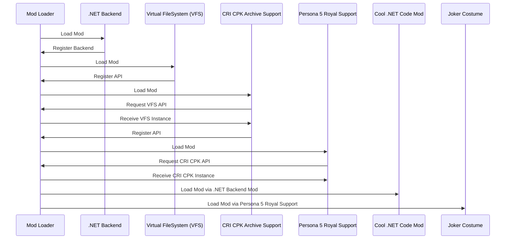

# Core Architecture

!!! tip "Did you know?"

    The first mod for [Persona 3 Portable on GameBanana][p3p-gamebanana] appeared
    ***40 minutes*** after the game released on PC?

    No custom code, loader/launcher changes or archive repacking needed. 
    The user set dependency on [Layer 1][layer-1] mod; it just worked, like magic.

The architecture below is an extension of a tried and tested architecture from [Reloaded-II][reloaded-ii].
Now with custom backends!

## Overall High Level View

!!! info "How does it all look from a top-down view?"

A typical setup for a certain recently released game might look something like this.

### Bootloader

!!! info "What is a Bootloader?"

    'Bootloader' in the spec refers to the component used to acquire arbitrary code execution inside the
    game's target process.

Basically, how we get our loader running.

Examples of some common approaches:

- [Windows: Dll Hijacking][win-dll-hijacking]
- [Windows: Dll Injection into Suspended Process][win-dll-inject]

### Mod Loader

!!! info "What does the Mod Loader do?"

    The mod loader is responsible for figuring out which mods to load, loading them, and
    acting as a hub for messages being passed between mods.

Responsibilities of the loader include:

- Locating the Profile for Current Game.
- Loading the Actual Mods.
- Logging: To File, Console etc.
- Crash Handling & Error Reporting, e.g. [Create a Minidump on Windows][create-minidump].
- Working around [DRM][drm].

It is ***extremely important*** that the loader only ships the bare essentials, nothing else!

### Mods

!!! note "This is for illustration purposes only."

    The 'Layers' presented below are only for the purposes of understanding how the overall system
    is composed; and how different mods rely on each other.

    When the loader rearranges the [load order][load-order]
    based on dependencies, the overall order should become something similar to this.

    To reiterate: There are no physical 'Layers' for mods in the Loader. This is just to help understanding.

#### Custom Backends (Layer 0)

!!! warning "Mods requiring a backend should transitively, or directly set a dependency on the backend."

    Mods which are missing a direct or transitive dependency should be ignored, and the backend
    should instead log a warning to the console.

    The [Diagnostics system][diagnostics] should warn users inside the launcher if it believes

!!! warning "The backend cannot have dependencies which rely on backend itself."

    In other words, you must avoid circular dependencies.

The purpose of this layer is to add support for various runtimes if required by specific programming
languages.

This layer can also be used for adding support for legacy mods from other loaders and/or legacy mods.

For more information see [Backends][backends].

#### Middleware/OS Handling Mods (Layer 1)

!!! info "These mods add support for common middleware, APIs and/or hooking of operating system functions."

The Examples in this are:

| Mod                     | Description                                                      |
|-------------------------|------------------------------------------------------------------|
| Virtual FileSystem      | Allows the game to see and open files which aren't really there. |
| CRI CPK Archive Support | Adds support for loading custom files in CRI Middleware `.CPK`.  |

The purpose of this layer is to provide the services and APIs necessary to make supporting new
games easy.

These are reusable components you can use from the mods in the upper layers.

!!! note "Note: The 'Classical' Approach"

    Traditionally each would write their own 'mod loader' from scratch to achieve these things;
    then copy the code for each subsequent project.

    This has a few issues:

    - Improvement in one project doesn't carry over to others.
    - People may not be aware of other projects.
    - Everyone has to reinvent the wheel.

    One of Reloaded3's main goals is to prevent this from happening.

#### Game Support (Layer 2)

!!! info "These mods serve as an abstraction layer between regular mods and the lower level components"

Mods in this layer have three main purposes:

1. Provide simplicity for non-programmers.
    - This mod will set dependencies on multiple other mods such as the
      `Virtual FileSystem` or `Archive Support`.

    - Someone who's making a mod that replaces game files
      ***should only ever need to set a dependency on this mod***.

2. Provide resiliency to game updates.
    - Providing high level API/SDKs for game functionality that are guaranteed to not break
      between updates.

    - Providing function signatures and definitions (via headers) for APIs not covered by
      high level API/SDK.

3. Providing interoperability between different mods:
    - Merging binary files (if needed) for various game file formats.

**Important:** For regular, non-technical modders; what matters is they just set a dependency on
your game mod when creating their mod. This would be usually covered in a 'getting started' guide.

#### Regular Mods (Layer 3)

!!! info "These are well, just regular mods."

They'll usually set a dependency on a layer 2 mod; and either just carry around game assets
to replace in game folder; or their own custom code.

## Lower Level Views

!!! tip "Shows how the overall system is composed using the sample of mods provided above."

### From Perspective of Layer 0 (Backend) Mod

The mod loader loads the mod. The backend mod uses a loader API to say 'hi, I can handle this [backend][backend]'.

Down the road when the loader tries to load `Cool .NET Code Mod`, it sees it has backend `coreclr-latest` declared in its config and
delegates loading to registered handler (`.NET Backend`).

### From Perspective of Layer 2 (Game Support) Mod

The `Mod Loader` loads the `Persona 5 Royal Support` Module as normal.

When down the road the loader loads the `Joker Costume` mod; an event `'ModLoaded'` is fired.

The `Persona 5 Royal Support` mod picks up the notification, sees the mod included some folder to
be added to the CPK Archive and calls the `CRI CPK Archive Support API` to map that folder.

!!! note "The 'mod was loaded' callback is fired for every mod out there; to enable interactions of this kind."

### Whole System

!!! info "A top down overview of the overall loading procedure."

!!! note

    This has been slightly simplified to exclude the lower level interactions necessary to load
    Backend based (Cool .NET Mod) and non-Code based (Joker Costume) mods shown above.

    Look above to see how that's handled more closely.

<!-- Links -->
[backends]: ./Backends/About.md
[backend]: ./Backends/About.md#custom-backends
[create-minidump]: ./Platforms/Windows.md#error-reporting
[diagnostics]: ../Server/Diagnostics.md
[drm]: ./Copy-Protection/About.md
[layer-1]: #middlewareos-handling-mods-layer-1
[load-order]: ../Server/Load-Ordering.md
[p3p-gamebanana]: https://gamebanana.com/games/16613
[reloaded-ii]: https://github.com/Reloaded-Project/Reloaded-II
[win-dll-hijacking]: ./Bootloaders/Windows-DllHijack.md
[win-dll-inject]: ./Bootloaders/Windows-InjectIntoSuspended.md