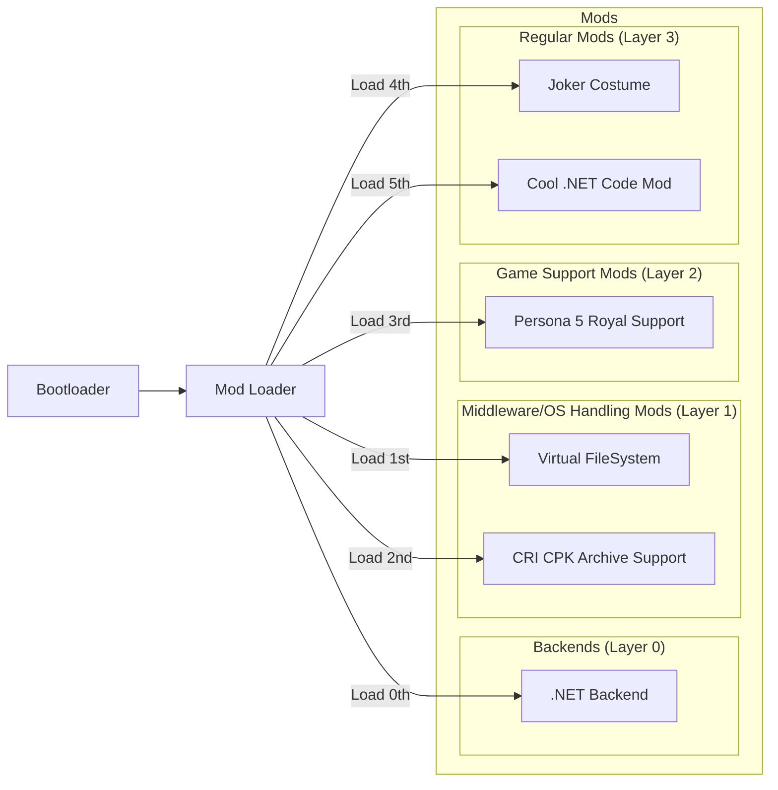

# Core Architecture

!!! note

    The architecture below is an extension of a tried and tested architecture from [Reloaded-II](https://github.com/Reloaded-Project/Reloaded-II).  
    Now with custom backends!

!!! tip

    Did you know the first mod for [Persona 3 on GameBanana](https://gamebanana.com/games/16613) appeared 
    ***40 minutes*** after the game released on PC? No custom code, loader/launcher changes or archive repacking needed.
    
    The user set dependency on Layer 1 mod; it just worked, like magic. 

## Overall High Level View

!!! info 

    How does it all look from a top-down view?

A typical setup for a certain recently released game might look something like this.

### Bootloader

!!! info

    'Bootloader' in the spec refers to the component used to acquire arbitrary code execution inside the 
    game's target process.

Basically, how we get our loader running.  

Examples of some common approaches:  

- [Windows: Dll Hijacking](./Bootloaders/Windows-DllHijack.md)  
- [Windows: Dll Injection into Suspended Process](./Bootloaders/Windows-InjectIntoSuspended.md)  

### Mod Loader

!!! info

    The mod loader is responsible for figuring out which mods to load, loading then, and 
    acting as a hub for messages being passed between mods.

Responsibilities of the loader include:  

- Locating the Profile for Current Game.  
- Logging: To File, Console etc.  
- Crash Handling & Error Reporting, e.g. [Create a Minidump on Windows](./Platforms/Windows.md#error-reporting).  
- Working around [DRM](./Bootloaders/Windows-DRM.md).  

### Mods

!!! note
    
    The 'Layers' presented below are only for the purposes of understanding how the overall system is composed; and how
    different mods rely on each other. When the loader rearranges the [load order](./Load-Ordering.md) 
    based on dependencies, the overall order should become something similar to this.

    To reiterate: There are no 'Layers' for mods in the Loader. This is just to help understanding.

#### Custom Backends (Layer 0)

!!! note

    The loader applies a rule that makes all backends load first, regardless of user load order.  
    Loading 'first' here means putting the backend in front of the mod list.  
    If a backend has dependencies, those can be loaded before the backend mod as usual.  

The purpose of this layer is to add support for various runtimes if required by specific programming languages, 
and/or adding support for legacy mods from other loaders. Basically stuff for other mods to run.

For more information see [Backends](./Backends/About.md).  

#### Middleware Handling Mods (Layer 1)

!!! info

    These mods add support for common middleware, APIs and/or hooking of operating system functions.

The Examples in this are:

| Mod                     | Description                                                      |
|-------------------------|------------------------------------------------------------------|
| Virtual FileSystem      | Allows the game to see and open files which aren't really there. |
| CRI CPK Archive Support | Adds support for loading custom files in CRI Middleware `.CPK`.  |

The purpose of this layer is to provide the services and APIs necessary to make supporting new games easy.  
These are reusable components you can use from the mods in the upper layers.  

!!! note

    Traditionally each would write their own 'mod loader' from scratch to achieve these things; then mindlessly copy
    the code for each subsequent project.

#### Game Support (Layer 2)

!!! info

    These mods abstract the game. Their purpose is providing a mechanism for handling in case of drastic changes.

Instead of writing your own whole 'mod loader' from scratch, you instead make a mod that simply sets a dependency on
e.g. `CRI CPK Archive Support`

... page to be completed