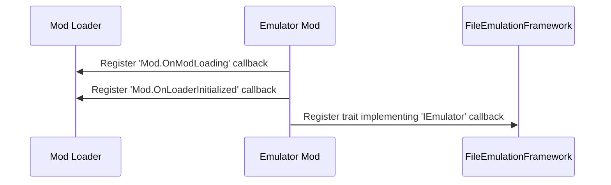
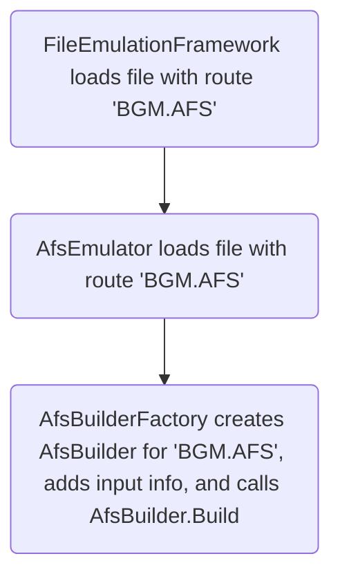

!!! info "The following steps detail the process of creating a new emulator"

    All of the hard stuff is abstracted away from you 😉, if you can write a
    file packer in Rust, you can write an archive emulator.<br/>

    Or any other kind too, of course 😇.

!!! note "Reference code here is from C# [AFS emulator][afs-emulator]"

    This code was translated to Rust via an LLM, and then updated by hand.

Use this page as a general guide to the process of creating a new emulator.

Once your emulator is done, make sure it adheres for the [Guidelines][guidelines].
And for more advanced interactions and use cases, see [Emulator Cookbook][emulator-cookbook].

## Initialization

!!! info "When your mod is initialising, you should register your emulator."

    As well as add some callbacks.



A Reloaded-II example:

```csharp
_modLoader.ModLoading += OnModLoading;
_modLoader.OnModLoaderInitialized += OnModLoaderInitialized;
_emulator = new AfsEmulator();

// Get emulation framework API and register our emulator
_modLoader.GetService<IEmulationFramework>().TryGetTarget(out var framework);
framework!.Register(_emulator);
```

There are 2 callbacks involved here.

### OnModLoading

!!! info "This is called when the mod loader is intializing a mod."

In this callback, you inspect the other mods' files and add them to the emulator input.

```csharp
public void OnModLoading(string modFolder)
{
    // 'Constants.inputFolder' is 'AFS' in this case,
    // i.e. folder 'AFS' in the other mod's folder.
    var inputFolder = $"{modFolder}/{Constants.inputFolder}";

    if (Directory.Exists(inputFolder))
        _builderFactory.AddFromFolders(inputFolder);
}
```

We use the 'builder' pattern to create emulators.
The significance of which will be explained in [Building Emulated Files](#building-emulated-files).

### OnModLoaderInitialized

!!! info "This is called after all mods have finished initializing."

In this callback, unsubscribe `OnModLoading` to stop receiving runtime loaded mods.

```csharp
_modLoader.ModLoading -= OnModLoading;
_modLoader.OnModLoaderInitialized -= OnModLoaderInitialized;
```

## Building Emulated Files

!!! info "Describes the Process in which Emulated Files are Created."

Emulated files are lazily built 'Just in Time' (JIT) as the original files are accessed.



Once all mods load, and the game logic begins, the game will eventually try to access
a file we wish to create or alter with emulation.

This will call the `IEmulator` (`AfsEmulator`) instance registered during the [initialize](#initialization) phase.

### Builder Factory

!!! info "The builder is where you create the emulator."

The Builder Factory stores information about all available emulator inputs.

Implementations of builder factories (`AfsBuilderFactory`) may sometimes vary slightly,
but usually follow a pattern described below.

#### Collecting Input Data

!!! info "This is called from your [OnModLoading](#onmodloading) callback."

```csharp
private List<RouteGroupTuple> _routeGroupTuples = new();

/// <summary>
/// Adds all available routes from an input folder.
/// </summary>
/// <param name="inputFolder">Folder containing the redirector's files.</param>
public void AddFromFolders(string inputFolder)
{
    // Get contents of folder. These return files grouped by directory.
    DirectorySearcher.GetDirectoryContentsRecursiveGrouped(inputFolder, out var groups);

    // Find matching folders.
    foreach (var group in groups)
    {
        if (group.Files.Length <= 0)
            continue;

        var route = Route.GetRoute(inputFolder, group.Directory.FullPath);

        _routeGroupTuples.Add(new RouteGroupTuple()
        {
            Route = new Route(route),
            Files = group
        });
    }
}
```

Here we look inside a mod's specified files they want to add as input to the emulator.

For a given mod folder with the layout:

```
ModFolder
└── FEmulator
    └── AFS
        ├── EVENT_ADX_E.AFS
        │   ├── 0_yahoo!.adx
        │   ├── 1_kick.adx
        │   └── 2_jump.adx
        └── EVENT_ADX_J.AFS
            ├── 0_yahoo!.adx
            ├── 1_kicku.adx
            └── 2_jumpu.adx
```

We get `inputFolder` pointing to the full path of `ModFolder/FEmulator/AFS`.
The call to `GetDirectoryContentsRecursiveGrouped` will return us 2 groups (folders) with

```
EVENT_ADX_E.AFS
├── 0_yahoo!.adx
├── 1_kick.adx
└── 2_jump.adx
```

and

```
EVENT_ADX_J.AFS
├── 0_yahoo!.adx
├── 1_kicku.adx
└── 2_jumpu.adx
```

These are then added to the `_routeGroupTuples` list, with the `route`(s) being
`EVENT_ADX_E.AFS` and `EVENT_ADX_J.AFS`.

!!! note "The routes for each folder is the path following `ModFolder/FEmulator/AFS`"

    So if you had a nested folder, e.g. `ModFolder/FEmulator/AFS/EVENT_ADX_E.AFS/EVENT_MUSIC.AFS`,
    its route would be `EVENT_ADX_E.AFS/EVENT_MUSIC.AFS`.

#### Creating Emulated File Builder

!!! info "This is called when the game [tries to access the file](#building-emulated-files)."

```csharp
/// <summary>
/// Tries to create an AFS from a given route.
/// </summary>
/// <param name="route">The route to create AFS Builder for.</param>
/// <param name="builder">The created builder.</param>
/// <returns>True if a builder could be made, else false (if there are no files to modify this AFS).</returns>
public bool TryCreateFromRoute(Route route, out AfsBuilder builder)
{
    builder = new AfsBuilder();
    foreach (var group in _routeGroupTuples)
    {
        // group.Route is "EVENT_ADX_E.AFS" or "EVENT_ADX_J.AFS" in this example.
        // it is NOT the full file path
        if (!route.MatchesNoSubfolder(group.Route))
            continue;

        // Add files to builder.
        var dir = group.Files.Directory.FullPath;
        foreach (var file in group.Files.Files)
            builder.AddOrReplaceFile(Path.Combine(dir, file));
    }

    return builder != null;
}
```

The logic here is pretty simple.

Suppose a file with path `<PATH_TO_GAME_FOLDER>/dvdroot/BGM/EVENT_ADX_E.AFS` is being opened.
This will be our `route` parameter, in `TryCreateFromRoute`.

We loop over our routes (listed below) and check which match the requested path.

```
EVENT_ADX_J.AFS
EVENT_ADX_E.AFS
```

`route.MatchesNoSubfolder` will test the `route` parameter against both of these. In this case, `EVENT_ADX_E.AFS`
will match, so we will add the files from that folder into the Builder's Input.

!!! note "`route.MatchesNoSubfolder` checks if the route ends with `input`."

    So if the full path is `<PATH_TO_GAME_FOLDER>/dvdroot/BGM/EVENT_ADX_E.AFS`,
    `route.Matches` will return `true` for `EVENT_ADX_E.AFS` because it ends with
    `EVENT_ADX_E.AFS`.

There is also `route.MatchesWithSubfolder`, which will allow for use of subfolders, at the cost of some speed.

See also: [Route.Matches truth table.][route-matches]

### Handling File Open Requests from FileEmulationFramework

!!! info

    When a new file is opened by the game, it gets sent to all registered emulators until one of the
    emulators 'accepts' the file, overriding the original file with the emulated one.

This is handled by your `IEmulator` that was registered during [initialization](#initialization).
Below is a sample implementation of an `IEmulator` that handles AFS files (`AfsEmulator`).

```csharp
private readonly AfsBuilderFactory _builderFactory = new();
private Dictionary<string, MultiStream?> _pathToStream = new(StringComparer.OrdinalIgnoreCase);

public bool TryCreateFile(IntPtr handle, string filepath, Route route, out IEmulatedFile emulatedFile)
{
    // Check if we already made a custom AFS for this file.
    emulatedFile = null!;

    // Check extension.
    // This is a quick filter to prevent unnecesarily reading from disk in actual file check.
    if (!filepath.EndsWith(Constants.AfsExtension, StringComparison.OrdinalIgnoreCase))
        return false;

    // Check if we've previously created an emulated file.
    if (_pathToStream.TryGetValue(filepath, out var multiStream))
    {
        // We temporarily set to `null` during building to avoid recursion into same file.
        if (multiStream == null)
            return false;

        emulatedFile = new EmulatedFile<MultiStream>(multiStream);
        return true;
    }

    return TryCreateEmulatedFile(handle, filepath, route, ref emulatedFile);
}

public bool TryCreateEmulatedFile(IntPtr handle, string filepath, Route route, ref IEmulatedFile emulatedFile)
{
    // Create a builder for the requested route.
    if (!_builderFactory.TryCreateFromPath(route, out var builder))
        return false;

    // Check file type by reading actual file header.
    if (!AfsChecker.IsAfsFile(handle))
        return false;

    // Avoid recursion into same file for when `Build` reads from original file.
    _pathToStream[filepath] = null;

    // Make the emulated file.
    var stream = builder!.Build(handle, filepath, _log);
    _pathToStream[filepath] = stream;
    emulatedFile = new EmulatedFile<MultiStream>(stream);
    return true;
}
```

Most emulators follow this pattern closely, with the framework calling your
`TryCreateFile` for every file it opens.

The implementation of this method is split into the following parts:

- A quick extension check, in this case, `.afs`.
    - This allows us to quickly return in case our emulator isn't the right now.
- A recursion lock.
    - In case `Build` reads from the original file, we must not recursively create an emulator.
- A call to [BuilderFactory](#builder-factory).
- A concrete check for file type.
    - This involves reading disk, so is the 'final check'.
    - See ['File Type Checking'](#file-type-checking) below.
- [Building the emulated file.](#building-the-emulated-file)
    - Assemble the emulated file from the original file and inputs added via [AfsBuilderFactory](#builder-factory)

!!! question "Why is `TryCreateFile` split into two methods?"

    APIs! Emulators can expose APIs that mods can use to create emulated files on the fly.

    A useful use case for this feature is when you have an huge archive, and want to emulate a sub
    archive within that archive without extracting it.

#### File Type Checking

!!! info "As last sanity check, look at the header of the file to check the magic bytes."

```csharp
public static bool IsAfsFile(IntPtr handle)
{
    var fileStream = new FileStream(new SafeFileHandle(handle, false), FileAccess.Read);
    var pos = fileStream.Position;

    try
    {
        return Read<int>(fileStream) == 0x534641; // 'AFS'
    }
    finally
    {
        fileStream.Dispose();
        Native.SetFilePointerEx(handle, pos, IntPtr.Zero, 0);
    }
}
```

!!! warning "It is very important you reset the file pointer after reading."

    If you don't, the remainder of code and game will read from wrong position.

### Building the Emulated File

!!! info "The final step, building the actual emulated file."

!!! note "This code is very emulator dependent!!"

    There is no 'one size fits all' solution here, as each file format is different, so the following
    is just an imaginary simple example with pseudocode.

Below is a slightly simplified example from a real emulator.

```csharp
public unsafe MultiStream Build(IntPtr handle, string filepath, Logger? logger = null)
{
    // Insert a link to the File Specification/layout here.
    // Spec: http://wiki.xentax.com/index.php/GRAF:AFS_AFS
    logger?.Info($"[{nameof(AfsBuilder)}] Building AFS File | {{0}}", filepath);

    // Get original file's entries.
    var entries = GetEntriesFromFile(handle);

    // Maximum ID of AFS file.
    // In this archive format, items are accessed by number, rather than name.
    var customFilesLength = _customFiles.Count > 0 ? _customFiles.Max(x => x.Key) + 1 : 0;
    var numFiles = Math.Max(customFilesLength, entries.Length);

    // Allocate Header
    // Note: We do not emit optional pointer to file metadata, but must reserve space for its null pointer, hence +1
    var headerLength = sizeof(AfsHeader) + (sizeof(AfsFileEntry) * (numFiles + 1));
    headerLength = Mathematics.RoundUp(headerLength, AfsAlignment);
    var headerStream = new MemoryStream(headerLength);
    headerStream.SetLength(headerLength);

    // Write header magic and file count
    headerStream.Write(0x00534641); // 'AFS '
    headerStream.Write(numFiles);

    // Make MultiStream with Header
    var pairs = new List<StreamOffsetPair<Stream>>()
    {
        // Header
        new (headerStream, OffsetRange.FromStartAndLength(0, headerStream.Length))
    };

    var currentOffset = headerLength;
    for (int x = 0; x < numFiles; x++)
    {
        int length = 0;
        int lengthWithPadding = 0;

        // Add a file to the stream-offset pair list.
        // Either custom, or from original archive.
        if (_customFiles.TryGetValue(x, out var overwrittenFile))
        {
            logger?.Info($"{nameof(AfsBuilder)} | Injecting {{0}}, in slot {{1}}", overwrittenFile.FilePath, x);

            // For custom files, add to pairs directly.
            length = overwrittenFile.Length;
            pairs.Add(new (new FileSliceStream(overwrittenFile, logger), OffsetRange.FromStartAndLength(currentOffset, length)));

            // And add padding if necessary.
            lengthWithPadding = Mathematics.RoundUp(length, AfsAlignment);
            var paddingBytes = lengthWithPadding - length;
            if (paddingBytes > 0)
                pairs.Add(new (new PaddingStream(0, paddingBytes), OffsetRange.FromStartAndLength(currentOffset + length, paddingBytes)));
        }
        else if (x < entries.Length)
        {
            // Data in official archives use 2048 byte padding. We will assume that padding is there.
            // If it is not, well, next file will be used as padding.
            // This is to allow merging of the streams for performance.
            length = entries[x].Length;
            lengthWithPadding = Mathematics.RoundUp(length, AfsAlignment);

            var originalEntry = new FileSlice(entries[x].Offset, lengthWithPadding, filepath);
            var stream = new FileSliceStream(originalEntry, logger);
            pairs.Add(new(stream, OffsetRange.FromStartAndLength(currentOffset, lengthWithPadding)));
        }
        else
        {
            // Otherwise have dummy file (no-op!)
        }

        // Write offset + length to header.
        headerStream.Write(length != 0 ? currentOffset : 0);
        headerStream.Write(length);

        // Advance offset.
        currentOffset += lengthWithPadding;
    }

    // Return MultiStream
    // This automatically merges 'pairs' under the hood.
    return new MultiStream(pairs, logger);
}
```

The jist is that you create a `List<StreamOffsetPair<Stream>>`.

This list contains tuples of a stream, and the range of bytes (`min`, `max`) that the stream
represents in the final, file. i.e. Offset 0 of stream is at `min`, and stream ends at `max`.

!!! warning "The streams should all form a complete file, with no gaps in the offsets."

The streams are then passed to a `MultiStream` constructor, which will handle the rest.

[afs-emulator]: https://github.com/Sewer56/FileEmulationFramework/tree/main/Emulator/AFS.Stream.Emulator
[emulator-cookbook]: ./Emulator-Cookbook.md
[guidelines]: ./Guidelines.md
[route-matches]: ./Routing.md#routematches