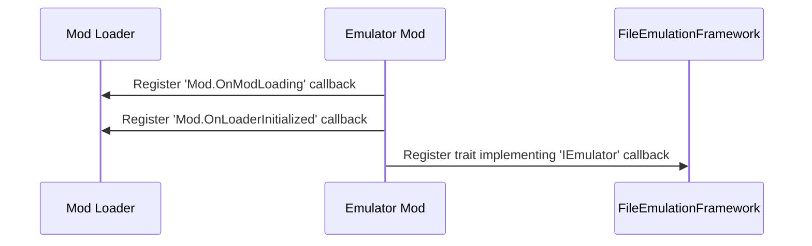
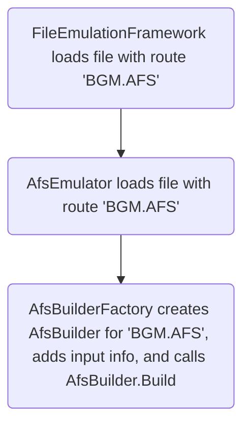

!!! info "The following steps detail the process of creating a new emulator"

    All of the hard stuff is abstracted away from you 😉, if you can write a
    file packer in Rust, you can write an archive emulator.<br/>

    Or any other kind too, of course 😇.

!!! note "Reference code here is from C# [AFS emulator][afs-emulator]"

    This code was translated to Rust via an LLM, and then updated by hand.

Use this page as a general guide to the process of creating a new emulator.

## Initialization

!!! info "When your mod is initialising, you should register your emulator."

    As well as add some callbacks.



A Reloaded-II example:

```csharp
_modLoader.ModLoading += OnModLoading;
_modLoader.OnModLoaderInitialized += OnModLoaderInitialized;
_emulator = new AfsEmulator();

// Get emulation framework API and register our emulator
_modLoader.GetService<IEmulationFramework>().TryGetTarget(out var framework);
framework!.Register(_emulator);
```

There are 2 callbacks involved here.

### OnModLoading

!!! info "This is called when the mod loader is intializing a mod."

In this callback, you inspect the other mods' files and add them to the emulator input.

```csharp
public void OnModLoading(string modFolder)
{
    // 'Constants.inputFolder' is 'AFS' in this case,
    // i.e. folder 'AFS' in the other mod's folder.
    var inputFolder = $"{modFolder}/{Constants.inputFolder}";

    if (Directory.Exists(inputFolder))
        _builderFactory.AddFromFolders(inputFolder);
}
```

We use the 'builder' pattern to create emulators.
The significance of which will be explained in [Building Emulated Files](#building-emulated-files).

### OnModLoaderInitialized

!!! info "This is called after all mods have finished initializing."

In this callback, unsubscribe `OnModLoading` to stop receiving runtime loaded mods.

```csharp
_modLoader.ModLoading -= OnModLoading;
_modLoader.OnModLoaderInitialized -= OnModLoaderInitialized;
```

## Building Emulated Files

!!! info "Describes the Process in which Emulated Files are Created."

Emulated files are lazily built 'Just in Time' (JIT) as the original files are accessed.



Once all mods load, and the game logic begins, the game will eventually try to access
a file we wish to create or alter with emulation.

This will call the `IEmulator` (`AfsEmulator`) instance registered during the [initialize](#initialization) phase.

### Builder Factory

!!! info "The builder is where you create the emulator."

The Builder Factory stores information about all available emulator inputs.

Implementations of builder factories (`AfsBuilderFactory`) may sometimes vary slightly,
but usually follow a pattern described below.

#### Collecting Input Data

!!! info "This is called from your [OnModLoading](#onmodloading) callback."

```csharp
private List<RouteGroupTuple> _routeGroupTuples = new();

/// <summary>
/// Adds all available routes from an input folder.
/// </summary>
/// <param name="inputFolder">Folder containing the redirector's files.</param>
public void AddFromFolders(string inputFolder)
{
    // Get contents of folder. These return files grouped by directory.
    DirectorySearcher.GetDirectoryContentsRecursiveGrouped(inputFolder, out var groups);

    // Find matching folders.
    foreach (var group in groups)
    {
        if (group.Files.Length <= 0)
            continue;

        var route = Route.GetRoute(inputFolder, group.Directory.FullPath);

        _routeGroupTuples.Add(new RouteGroupTuple()
        {
            Route = new Route(route),
            Files = group
        });
    }
}
```

Here we look inside a mod's specified files they want to add as input to the emulator.

For a given mod folder with the layout:

```
ModFolder
└── FEmulator
    └── AFS
        ├── EVENT_ADX_E.AFS
        │   ├── 0_yahoo!.adx
        │   ├── 1_kick.adx
        │   └── 2_jump.adx
        └── EVENT_ADX_J.AFS
            ├── 0_yahoo!.adx
            ├── 1_kicku.adx
            └── 2_jumpu.adx
```

We get `inputFolder` pointing to the full path of `ModFolder/FEmulator/AFS`.
The call to `GetDirectoryContentsRecursiveGrouped` will return us 2 groups (folders) with

```
EVENT_ADX_E.AFS
├── 0_yahoo!.adx
├── 1_kick.adx
└── 2_jump.adx
```

and

```
EVENT_ADX_J.AFS
├── 0_yahoo!.adx
├── 1_kicku.adx
└── 2_jumpu.adx
```

These are then added to the `_routeGroupTuples` list, with the `route`(s) being
`EVENT_ADX_E.AFS` and `EVENT_ADX_J.AFS`.

!!! note "The routes for each folder is the path following `ModFolder/FEmulator/AFS`"

    So if you had a nested folder, e.g. `ModFolder/FEmulator/AFS/EVENT_ADX_E.AFS/EVENT_MUSIC.AFS`,
    its route would be `EVENT_ADX_E.AFS/EVENT_MUSIC.AFS`.

#### Building The Emulated File

!!! info "This is called when the game [tries to access the file](#building-emulated-files)."

```csharp
/// <summary>
/// Tries to create an AFS from a given route.
/// </summary>
/// <param name="route">The route to create AFS Builder for.</param>
/// <param name="builder">The created builder.</param>
/// <returns>True if a builder could be made, else false (if there are no files to modify this AFS).</returns>
public bool TryCreateFromRoute(Route route, out AfsBuilder builder)
{
    builder = new AfsBuilder();
    foreach (var group in _routeGroupTuples)
    {
        // group.Route is "EVENT_ADX_E.AFS" or "EVENT_ADX_J.AFS" in this example.
        // it is NOT the full file path
        if (!route.Matches(group.Route))
            continue;

        // Add files to builder.
        var dir = group.Files.Directory.FullPath;
        foreach (var file in group.Files.Files)
            builder.AddOrReplaceFile(Path.Combine(dir, file));
    }

    return builder != null;
}
```

The logic here is pretty simple.

Suppose a file with path `<PATH_TO_GAME_FOLDER>/dvdroot/BGM/EVENT_ADX_E.AFS` is being opened.
This will be our `route` parameter, in `TryCreateFromRoute`.

We loop over our routes (listed below) and check which match the requested path.

```
EVENT_ADX_J.AFS
EVENT_ADX_E.AFS
```

`route.Matches` will test the `route` parameter against both of these. In this case, `EVENT_ADX_E.AFS`
will match, so we will add the files from that folder into the Builder's Input.

!!! note "`route.Matches` checks if the route ends with `input`."

    So if the full path is `<PATH_TO_GAME_FOLDER>/dvdroot/BGM/EVENT_ADX_E.AFS`,
    `route.Matches` will return `true` for `EVENT_ADX_E.AFS` because it ends with
    `EVENT_ADX_E.AFS`.

See also: [Route.Matches truth table.][route-matches]

[afs-emulator]: https://github.com/Sewer56/FileEmulationFramework/tree/main/Emulator/AFS.Stream.Emulator
[route-matches]: ./Routing.md#routematches