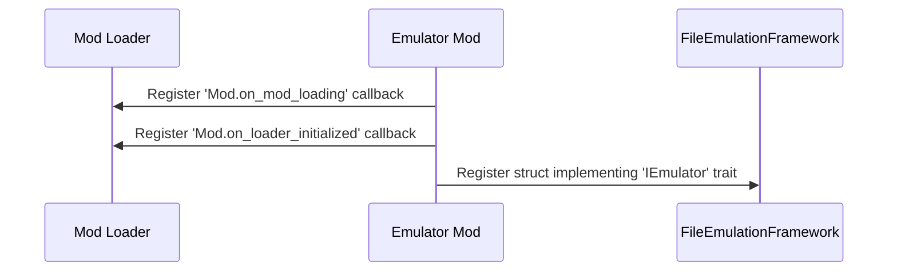
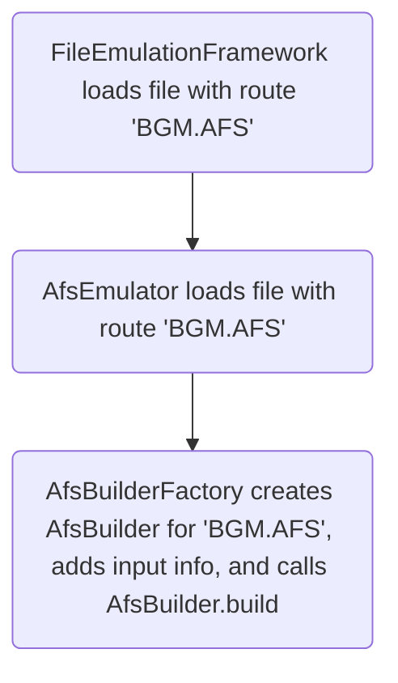

!!! info "The following steps detail the process of creating a new emulator"

    All of the hard stuff is abstracted away from you 😉, if you can write a
    file packer in Rust, you can write an archive emulator.<br/>

    Or any other kind too, of course 😇.

!!! note "Reference code here is from C# [AFS emulator][afs-emulator]"

    This code was translated to Rust via an LLM, and then updated by hand.

!!! note "The code below uses `format!` for clarity."

    In the real code, a different API should be used to avoid increasing the binary size
    by unreasonable amounts.

!!! warning "TODO: Abstract away some common code."

    Structs like (Afs)`BuilderFactory` are common across all emulators and rarely change.<br/>
    We should abstract them to make all emulators not have to rewrite the same code over again.

Use this page as a general guide to the process of creating a new emulator.
It shows you how the emulators are built.

Once your emulator is done, make sure it adheres to the [Guidelines][guidelines].
And for more advanced interactions and use cases, see [Emulator Cookbook][emulator-cookbook].

## Initialization

!!! info "When your mod is initialising, you should register your emulator."

    As well as add some callbacks.



A Reloaded-II example in Rust:

```rust
mod_loader.on_mod_loading(on_mod_loading);
mod_loader.on_mod_loader_initialized(on_mod_loader_initialized);
let emulator = AfsEmulator::new();

// Get emulation framework API and register our emulator
let framework = mod_loader.get_service::<IFileEmulationFramework>().unwrap();
framework.register(Box::new(emulator));
```

There are 2 callbacks involved here.

### on_mod_loading

!!! info "This is called when the mod loader is intializing a mod."

In this callback, you inspect the other mods' files and add them to the emulator input.

```rust
fn on_mod_loading(mod_folder: &str) {
    // 'Constants.input_folder' is 'AFS' in this case,
    // i.e. folder 'AFS' in the other mod's folder.
    let input_folder = format!("{}/{}", mod_folder, Constants.input_folder);

    if Path::new(&input_folder).is_dir() {
        builder_factory.add_from_folders(&input_folder);
    }
}
```

We use the 'builder' pattern to create emulators.
The significance of which will be explained in [Building Emulated Files](#building-emulated-files).

### on_mod_loader_initialized

!!! info "This is called after all mods have finished initializing."

In this callback, unsubscribe `on_mod_loading` to stop receiving runtime loaded mods.

```rust
mod_loader.on_mod_loading(None);
mod_loader.on_mod_loader_initialized(None);
```

## Building Emulated Files

!!! info "Describes the Process in which Emulated Files are Created."

Emulated files are lazily built 'Just in Time' (JIT) as the original files are accessed.



Once all mods load, and the game logic begins, the game will eventually try to access
a file we wish to create or alter with emulation.

This will call the `IEmulator` (`AfsEmulator`) instance registered during the [initialize](#initialization) phase.

### Builder Factory

!!! info "The builder is where you create the emulator."

!!! note "This builder factory is a bit simpler than the real deal."

    We skipped some optimizations here to keep the example simple.

The Builder Factory stores information about all available emulator inputs.

Implementations of builder factories (`AfsBuilderFactory`) may sometimes vary slightly,
but usually follow a pattern described below.

#### Collecting Input Data

!!! info "This is called from your [on_mod_loading](#on_mod_loading) callback."

```rust
struct RouteGroupTuple {
    route: Route,
    files: FileGroup,
}

struct AfsBuilderFactory {
    route_group_tuples: Vec<RouteGroupTuple>,
}

impl AfsBuilderFactory {
    /// Adds all available routes from an input folder.
    pub fn add_from_folders(&mut self, input_folder: &OsStr) {
        // Get contents of folder. These return files grouped by directory.
        let groups = DirectorySearcher::get_directory_contents_recursive_grouped(input_folder);

        // Find matching folders.
        for group in groups {
            if !group.has_files() {
                continue;
            }

            let route = Route::from_folder_and_full_path(input_folder, group.get_directory_full_path());
            self.route_group_tuples.push(RouteGroupTuple {
                route: Route::new(route),
                files: group,
            });
        }
    }
}
```

Here we look inside a mod's specified files they want to add as input to the emulator.

For a given mod folder with the layout:

```
ModFolder
└── FileEmulationFramework
    └── AFS
        ├── EVENT_ADX_E.AFS
        │   ├── 0_yahoo!.adx
        │   ├── 1_kick.adx
        │   └── 2_jump.adx
        └── EVENT_ADX_J.AFS
            ├── 0_yahoo!.adx
            ├── 1_kicku.adx
            └── 2_jumpu.adx
```

We get `inputFolder` pointing to the full path of `<ModFolder>/FileEmulationFramework/AFS`.
The call to `get_directory_contents_recursive_grouped` will return us 2 groups (folders) with

```
EVENT_ADX_E.AFS
├── 0_yahoo!.adx
├── 1_kick.adx
└── 2_jump.adx
```

and

```
EVENT_ADX_J.AFS
├── 0_yahoo!.adx
├── 1_kicku.adx
└── 2_jumpu.adx
```

These are then added to the `route_group_tuples` list, with the `route`(s) being
`EVENT_ADX_E.AFS` and `EVENT_ADX_J.AFS`.

!!! note "The routes for each folder is the path following `<ModFolder>/FileEmulationFramework/AFS`"

    So if you had a nested folder, e.g. `<ModFolder>/FileEmulationFramework/AFS/EVENT_ADX_E.AFS/EVENT_MUSIC.AFS`,
    its route would be `EVENT_ADX_E.AFS/EVENT_MUSIC.AFS`.

#### Creating Emulated File Builder

!!! info "This is called when the game [tries to access the file](#building-emulated-files)."

```rust
impl AfsBuilderFactory {
    /// Tries to create an AFS from a given route.
    /// # Arguments
    /// * `route` - The route to create AFS Builder for.
    /// # Returns
    /// * A builder which may or may not have files added to it
    pub fn try_create_from_route(&mut self, route: &Route) -> AfsBuilder {
        let mut builder = AfsBuilder::new();
        for group in &self.route_group_tuples {
            // group.route is "EVENT_ADX_E.AFS" or "EVENT_ADX_J.AFS" in this example.
            // it is NOT the full file path
            if !route.matches_no_subfolder(&group.route) {
                continue;
            }

            // Add files to builder.
            let dir = &group.get_directory_full_path();
            for file in &group.get_files() {
                builder.add_or_replace_file(Path::new(dir).join(file));
            }
        }

        builder
    }
}
```

The logic here is pretty simple.

Suppose a file with path `<PATH_TO_GAME_FOLDER>/dvdroot/BGM/EVENT_ADX_E.AFS` is being opened.
This will be our `route` parameter, in `try_create_from_route`.

We loop over our routes (listed below) and check which match the requested path.

```
EVENT_ADX_J.AFS
EVENT_ADX_E.AFS
```

`route.matches_no_subfolder` will test the `route` parameter against both of these. In this case, `EVENT_ADX_E.AFS`
will match, so we will add the files from that folder into the Builder's Input.

!!! note "`route.matches_no_subfolder` checks if the route ends with `input`."

    So if the full path is `<PATH_TO_GAME_FOLDER>/dvdroot/BGM/EVENT_ADX_E.AFS`,
    `route.matches` will return `true` for `EVENT_ADX_E.AFS` because it ends with
    `EVENT_ADX_E.AFS`.

There is also `route.matches_with_subfolder`, which will allow for use of subfolders, at the cost of some speed.

See also: [route.matches truth table.][route-matches]

### Handling File Open Requests from FileEmulationFramework

!!! info

    When a new file is opened by the game, it gets sent to all registered emulators until one of the
    emulators 'accepts' the file, overriding the original file with the emulated one.

This is handled by your `IEmulator` that was registered during [initialization](#initialization).
Below is a sample implementation of an `IEmulator` that handles AFS files (`AfsEmulator`).

```rust
struct AfsEmulator {
    builder_factory: AfsBuilderFactory,
    path_to_stream: HashMap<String, Option<MultiStream>>,
}

impl IEmulator for AfsEmulator {
    fn try_create_file(&mut self, handle: RawHandle, filepath: &OsStr, length: FileLength, route: &Route) -> Option<Box<dyn IEmulatedFile>> {
        // Check extension.
        // This is a quick filter to prevent unnecesarily reading from disk in actual file check.
        if !filepath.to_str().map(|s| s.to_lowercase().ends_with(Constants.afs_extension)).unwrap_or(false) {
            return None;
        }

        // Check if we've previously created an emulated file.
        if let Some(multi_stream) = self.path_to_stream.get(filepath.to_str().unwrap()) {
            // We temporarily set to `None` during building to avoid recursion into same file.
            if multi_stream.is_none() {
                return None;
            }

            return Some(Box::new(EmulatedFile::new(multi_stream.clone())));
        }

        self.try_create_emulated_file(handle, filepath, route)
    }

    fn try_create_emulated_file(&mut self, handle: RawHandle, filepath: &OsStr, route: &Route) -> Option<Box<dyn IEmulatedFile>> {
        // Create a builder for the requested route.
        let builder = match self.builder_factory.try_create_from_route(route);
        if builder.is_empty() {
            return None;
        }

        // Check file type by reading actual file header.
        if !is_afs_file(handle) {
            return None;
        }

        // Avoid recursion into same file for when `build` reads from original file.
        let file_path_str = filepath.to_string();
        self.path_to_stream.insert(file_path_str, None);

        // Make the emulated file.
        let stream = builder.build(handle, filepath, route, None);
        self.path_to_stream.insert(file_path_str, Some(stream.clone()));

        Some(Box::new(EmulatedFile::new(stream)))
    }
}
```

Most emulators follow this pattern closely, with the framework calling your
`try_create_file` for every file it opens.

The implementation of this method is split into the following parts:

- A quick extension check, in this case, `.afs`.
    - This allows us to quickly return in case our emulator isn't the right one.
- A recursion lock.
    - In case `build` reads from the original file, we must not recursively create an emulator.
- A call to [BuilderFactory](#builder-factory).
- A concrete check for file type.
    - This involves reading disk, so is the 'final check'.
    - See ['File Type Checking'](#file-type-checking) below.
- [Building the emulated file.](#building-the-emulated-file)
    - Assemble the emulated file from the original file and inputs added via [AfsBuilderFactory](#builder-factory)

!!! question "Why is `try_create_file` split into two methods?"

    APIs! Emulators can expose APIs that mods can use to create emulated files on the fly.

    A useful use case for this feature is when you have a huge archive, and want to emulate a sub
    archive within that archive without extracting it.

!!! warning "`try_create_emulated_file` must not move the file pointer."

    If you move the file pointer, the caller, will end up reading from the wrong position.

#### File Type Checking

!!! info "As last sanity check, look at the header of the file to check the magic bytes."

```rust
pub fn is_afs_file(handle: RawHandle) -> bool {
    let result = read_file::<u32le>().expect("Failed to read file") == 0x534641; // 'AFS'
    seek_file(handle, -size_of::<u32le>(), SeekOrigin::Current).expect("Failed to reset position");
    result
}
```

!!! warning "It is very important you reset the file pointer after reading."

    If you don't, the remainder of code and game will read from wrong position.

### Building the Emulated File

!!! info "The final step, building the actual emulated file."

!!! note "This code is very emulator dependent!!"

    There is no 'one size fits all' solution here, as each file format is different, so the following
    is just an imaginary simple example with pseudocode.

Below is a slightly simplified example from a real emulator.

```rust
impl AfsBuilder {
    pub fn build(&self, handle: RawHandle, filepath: &OsStr, route: &Route, logger: &Logger) -> MultiStream {
        // Insert a link to the File Specification/layout here.
        // Spec: http://wiki.xentax.com/index.php/GRAF:AFS_AFS
        logger.info(&format!("[AfsBuilder] Building AFS File | {}", filepath));

        // Get original file's entries.
        let entries = self.get_entries_from_file(handle);

        // Maximum ID of AFS file.
        // In this archive format, items are accessed by number, rather than name.
        let custom_files_length = if !self.custom_files.is_empty() {
            *self.custom_files.keys().max().unwrap() + 1
        } else {
            0
        };

        let num_files = custom_files_length.max(entries.len());

        // Allocate Header
        // Note: We do not emit optional pointer to file metadata, but must reserve space for its null pointer, hence +1
        let mut header_length = size_of::<AfsHeader>() + (size_of::<AfsFileEntry>() * (num_files + 1));
        header_length = Mathematics::round_up(header_length, AfsAlignment);
        let mut header_stream = MemoryStream::with_capacity(header_length);
        header_stream.set_length(header_length);

        // Write header magic and file count
        header_stream.write_u32::<LittleEndian>(0x00534641).expect("Failed to write magic"); // 'AFS '
        header_stream.write_u32::<LittleEndian>(num_files as u32).expect("Failed to write file count");

        // Make MultiStream with Header
        let mut pairs = vec![
            StreamOffsetPair::new(Box::new(header_stream), OffsetRange::from_start_and_length(0, header_length))
        ];

        let mut current_offset = header_length as u64;
        for x in 0..num_files {
            let (length, length_with_padding) = if let Some(overwritten_file) = self.custom_files.get(&x) {
                logger.info(&format!("AfsBuilder | Injecting {}, in slot {}", overwritten_file.filepath, x));

                // For custom files, add to pairs directly.
                let length = overwritten_file.length as u64;
                pairs.push(StreamOffsetPair::new(
                    Box::new(FileSliceStream::new(overwritten_file.clone(), logger)),
                    OffsetRange::from_start_and_length(current_offset, length)
                ));

                // And add padding if necessary.
                let length_with_padding = Mathematics::round_up(length, AfsAlignment);
                let padding_bytes = length_with_padding - length;
                if padding_bytes > 0 {
                    pairs.push(StreamOffsetPair::new(
                        Box::new(PaddingStream::new(0, padding_bytes)),
                        OffsetRange::from_start_and_length(current_offset + length, padding_bytes)
                    ));
                }

                (length, length_with_padding)
            } else if x < entries.len() {
                // Data in official archives use 2048 byte padding. We will assume that padding is there.
                // If it is not, well, next file will be used as padding.
                // This is to allow merging of the streams for performance.
                let length = entries[x].length as u64;
                let length_with_padding = Mathematics::round_up(length, AfsAlignment);

                let original_entry = FileSlice::new(entries[x].offset, length_with_padding, filepath);
                let stream = FileSliceStream::new(original_entry, logger);

                // TODO: Assemble new 'route' and pass to framework, so another emulator can pick up.
                pairs.push(StreamOffsetPair::new(
                    Box::new(stream),
                    OffsetRange::from_start_and_length(current_offset, length_with_padding)
                ));

                (length, length_with_padding)
            } else {
                // Otherwise have dummy file (no-op!)
                (0, 0)
            };

            // Write offset + length to header.
            let offset_to_write = if length != 0 { current_offset as u32 } else { 0 };
            header_stream.write_u32::<LittleEndian>(offset_to_write).expect("Failed to write offset");
            header_stream.write_u32::<LittleEndian>(length as u32).expect("Failed to write length");

            // Advance offset.
            current_offset += length_with_padding;
        }

        // Return MultiStream
        // This automatically merges 'pairs' under the hood.
        MultiStream::new(pairs, logger.cloned())
    }
}
```

The gist is that you create a `Vec<StreamOffsetPair<Box<dyn Stream>>>`.

This vector contains tuples of a stream, and the range of bytes (`min`, `max`) that the stream
represents in the final file. i.e. Offset 0 of stream is at `min`, and stream ends at `max`.

!!! warning "The streams should all form a complete file, with no gaps in the offsets."

The streams are then passed to a `MultiStream` constructor, which will handle the rest.

!!! note "Notice we don't reuse the handle."

    We can't risk unexpected failures as a result of concurrent reads.
    This is where the recursion lock from `try_create_file` becomes handy 😉.

[afs-emulator]: https://github.com/Sewer56/FileEmulationFramework/tree/main/Emulator/AFS.Stream.Emulator
[emulator-cookbook]: ./Emulator-Cookbook.md
[guidelines]: ./Guidelines.md
[route-matches]: ./Routing.md#routematches