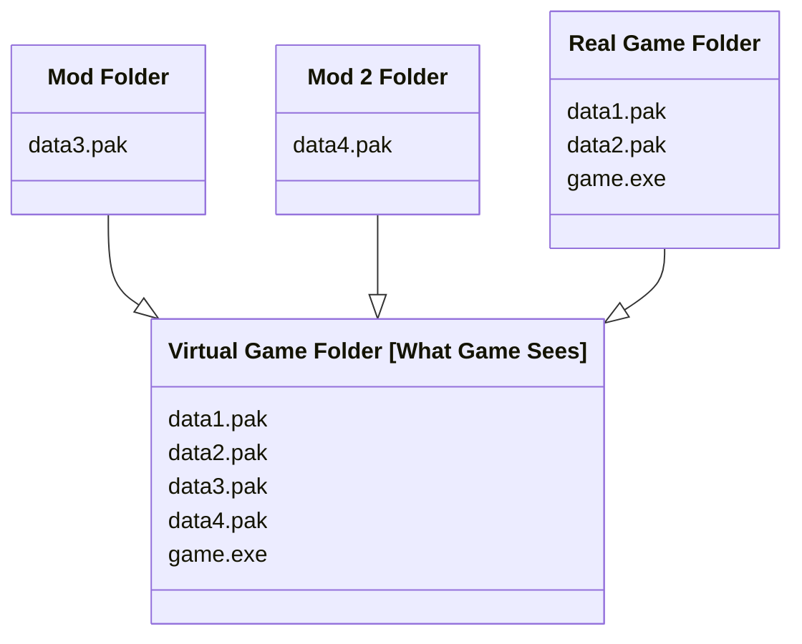

# About the Reloaded Virtual FileSystem

The Reloaded Virtual File System (VFS) is an invisible helper that sits between your games and the files they use. It allows your games to 'see' and open files that aren't really 'there', keeping your game folder unmodified.

The VFS sits in the middle and does some magic 😇.

## Characteristics

Compared to Windows symlinks/hardlinks:

- Links are only visible to the current application.
- Write access to game folder is not needed. Can even link new content into read-only folders.
- Administrator rights are not needed.
- Can overlay multiple directories on top of the destination.

And with the following benefits:

- Easy to use API for programmers.
- Practically zero overhead.
- Can add/remove and remap files on the fly (without making changes on disk).
- Supports Wine on Linux.

## Limitations

The Reloaded VFS only implements *well defined* functionality, effectively becoming a ***read-only*** VFS. Write operations, such as creating a file are unaffected.

If a game wants to write a new file (such as a savefile), no action will be taken and the file will be written to the game folder. If a native DLL plugin wants to write a config file, it will write it to the game folder, as normal.

### Warning

Proceed with care if any of the following applies:

- If your game's modding tools operate on a modified game directory (e.g. Skyrim xEdit), using VFS is not recommended as new files might be written to the game folder.

- Do not use VFS to redirect files deleted and then recreated by games; ***you will lose the files from inside your mod***.

### Error Cases

Using this VFS is not appropriate for your game if any of the following is true.

- This VFS does not handle child processes. Do not use VFS for games that can run external tools with virtualized files.

### Additional Limitations

The following limitations should not cause concern.

- Reloaded VFS does not support Reparse Point Tags.
    - However, this shouldn't cause issues with mods stored on cloud/OneDrive/etc.
- Reloaded VFS does not return 8.3 DOS file names for virtualized files.

## File Write Behaviours

Reloaded VFS is a read-only VFS, so what happens when you try editing files?

| Description                        | Action Performed                                                                           |
|------------------------------------|------------------------------------------------------------------------------------------|
| File Deletion                      | Delete the mod file instead of the original file                                           |
| New File Creation                  | Create new files in the original game folder                                               |
| File Editing                       | Edits the redirected file                                                                  |
| File Delete & Recreate (New)       | Delete the overwritten file and place the new file in game folder                          |
| Renaming Folders to Other Location | Either move the original folder or files in original and overlaid folders (depends on how API is used) |