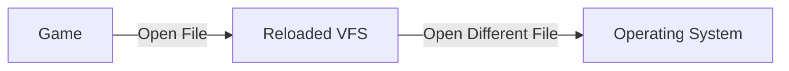
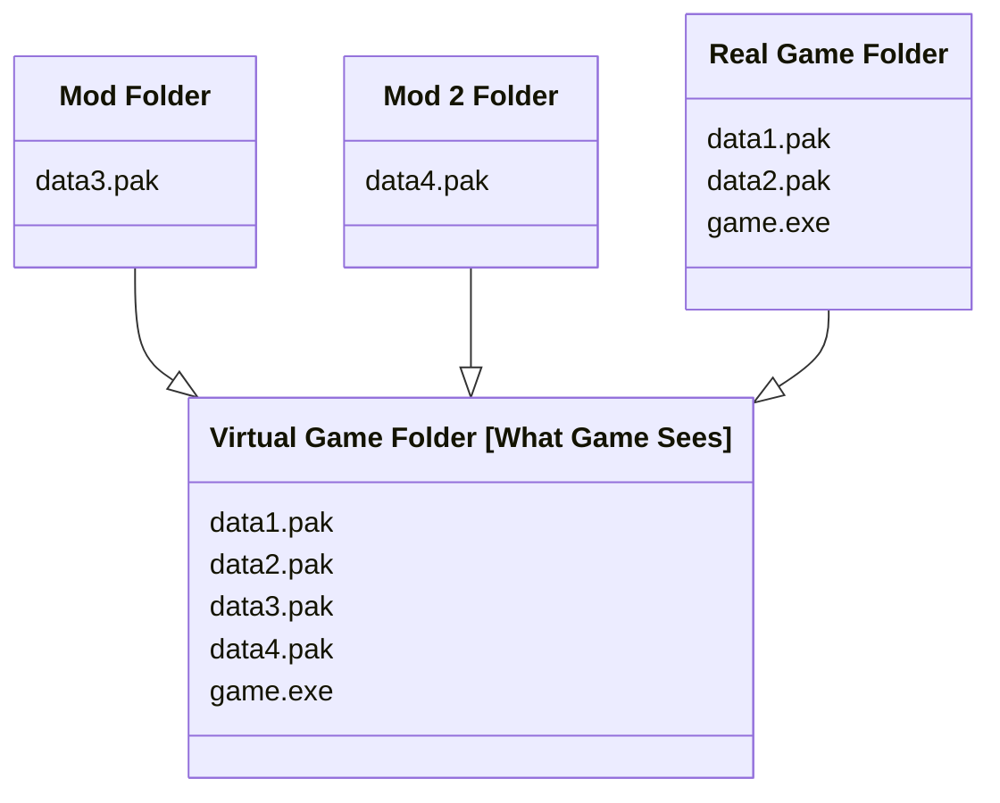

# About the Reloaded Virtual FileSystem

The Reloaded Virtual File System (VFS) is an invisible helper that sits between your games and the
files they use. It allows your games to 'see' and open files that aren't really 'there', keeping
your game folder unmodified.

The VFS sits in the middle and does some magic 😇.

## Characteristics

Compared to Windows symlinks/hardlinks:

- Links are only visible to the current application.
- Write access to game folder is not needed. Can even link new content into read-only folders.
- Administrator rights are not needed.
- Can overlay multiple directories on top of the destination.

And with the following benefits:

- Easy to use API for programmers.
- Practically zero overhead.
- Can add/remove and remap files on the fly (without making changes on disk).
- Supports Wine on Linux.
