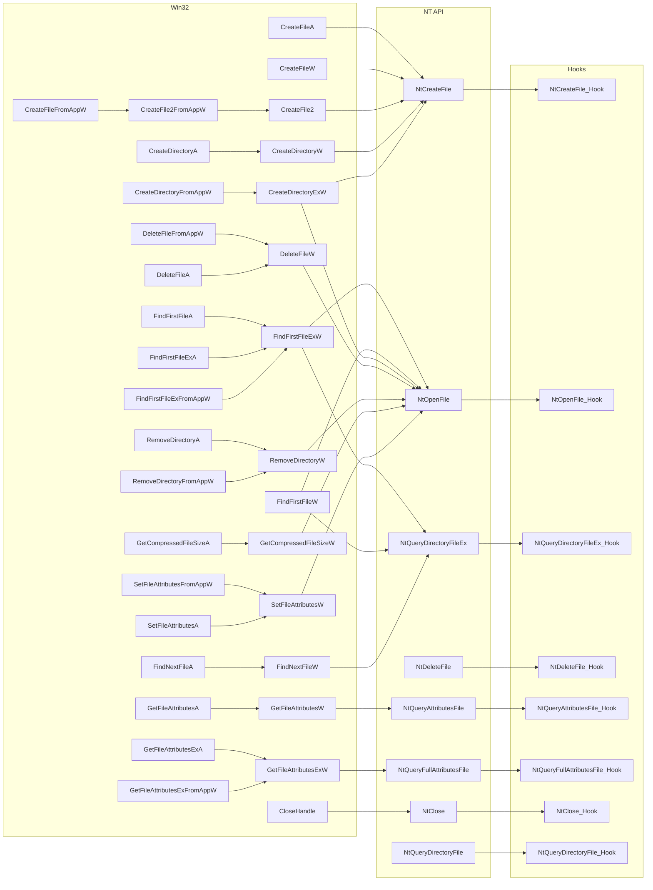

!!! info "This currently only contains information for Windows."

    Native support for other OSes will be added in the future.

## Used Hooks

The VFS hooks several Win32 and NT File APIs to intercept file operations. The goal is to handle every API which:

- Accepts a File Path: In this case we set a new path to our redirected file.

- Returns Files at Given Path: In this case we inject new files into the result.

Here is a flowchart of the hooked APIs:

On Windows 10+, `NtQueryDirectoryFileEx` API becomes available and `NtQueryDirectoryFile` acts as
a wrapper around it. On Wine and earlier Windows, only `NtQueryDirectoryFile` exists.

In this VFS we hook both, and detect if one recurses to the other using a semaphore. If we're
recursing from `NtQueryDirectoryFile` to `NtQueryDirectoryFileEx`, we skip the hook code.