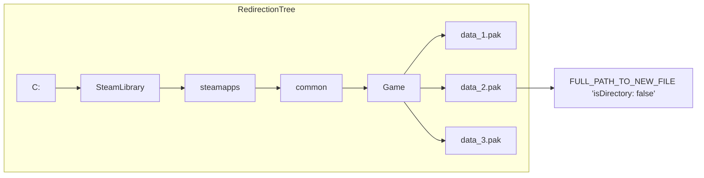
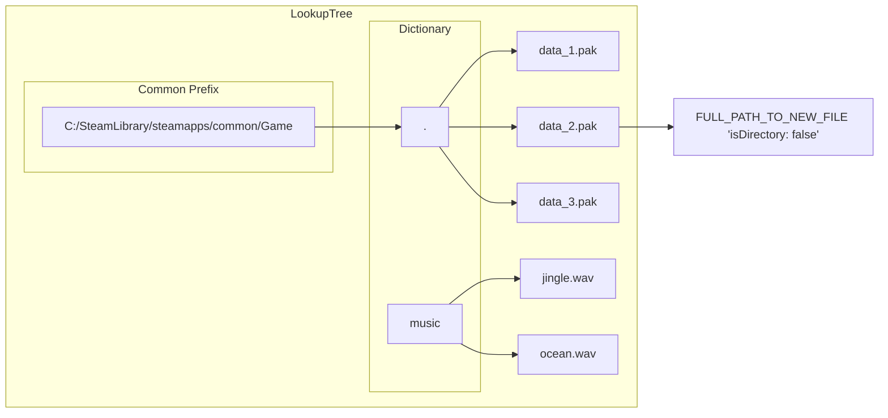

!!! info "This page detail the 'Tree' implementations used in the VFS."

The actual struct definitions here are valid for the original C# implementation, but will differ a
tiny bit in the Rust implementation. We still show the C# ones for simplicity, to help understanding.

## Redirection Tree

!!! info "About the 'Redirection Tree'"

    The `RedirectionTree` is a visualization of the data structure used to map paths of old files
    to new files as the mods are loading during startup.

    It uses an O(N) lookup time (where N is the number of components separated by '/') that make up
    the final file path.

The resolution steps are:

1. Start at tree root.
2. Split the input path on '/' character.
3. Traverse the tree one level at a time, using each split component to move down next level.
4. At each level check if there's a child node corresponding to current path component.
    - If there is no child node, lookup has failed and path is not in the tree.
5. When all components have been consumed, check the `Items` dictionary of the final node reached to see if the path is present.
6. If it is, the lookup succeeds and the corresponding value is returned. If it is not, the lookup fails and the path is not found in the tree.

When all mods are loaded, this trie-like structure is converted to a `LookupTree`.



### In Code

```csharp
/// <summary>
/// Represents that will be used for performing redirections.
/// </summary>
public struct RedirectionTree<TTarget>
{
    /// <summary>
    /// Root nodes, e.g. would store drive: C:/D:/E: etc.
    /// In most cases there is only one.
    /// </summary>
    public RedirectionTreeNode<TTarget> RootNode { get; private set; }
}
```

```csharp
/// <summary>
/// Individual node in the redirection tree.
/// </summary>
public struct RedirectionTreeNode<TTarget>
{
    /// <summary>
    /// Child nodes of this nodes.
    /// i.e. Maps 'folder' to next child.
    /// </summary>
    public SpanOfCharDict<RedirectionTreeNode<TTarget>> Children;

    /// <summary>
    /// Files present at this level of the tree.
    /// </summary>
    public SpanOfCharDict<TTarget> Items;
}
```

```csharp
/// <summary>
/// Target for a file covered by the redirection tree.
/// </summary>
public struct RedirectionTreeTarget
{
    /// <summary>
    /// Path to the directory storing the file.
    /// </summary>
    public string Directory; // (This is deduplicated, saving memory)

    /// <summary>
    /// Name of the file in the directory.
    /// </summary>
    public string FileName;

    /// <summary>
    /// True if this is a directory, else false.
    /// </summary>
    public bool IsDirectory;
}
```

## Lookup Tree

!!! info "About the 'Lookup Tree'"

    The `LookupTree` is a visualization of the data structure used to map paths of old files to new
    files ***after*** all mods are loaded during startup.

    When all mods are loaded, this structure is generated from the `RedirectionTree`.

The idea is that usually the VFS will be used to redirect game files only.

It uses a strategy of:

1. Check common prefix.
2. Check remaining path in dictionary.
3. Check file name in dictionary.

The prefix is based on the idea that a game will have all of its files stored under a common folder path.
We use this to save memory in potentially huge games.



### In Code

```csharp
/// <summary>
/// A version of <see cref="RedirectionTree"/> optimised for faster lookups in the scenario of use with game folders.
/// </summary>
public struct LookupTree<TTarget>
{
    /// <summary>
    /// Prefix of all paths.
    /// Stored in upper case for faster performance.
    /// </summary>
    public string Prefix { get; private set; }

    /// <summary>
    /// Dictionary that maps individual subfolders to map of files.
    /// </summary>
    public SpanOfCharDict<SpanOfCharDict<TTarget>> SubfolderToFiles { get; private set; }
}
```