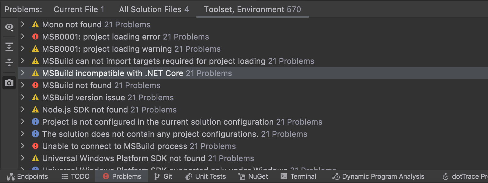
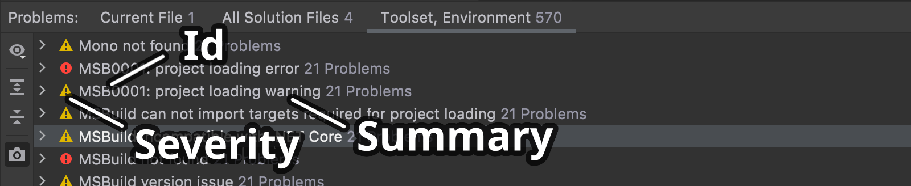
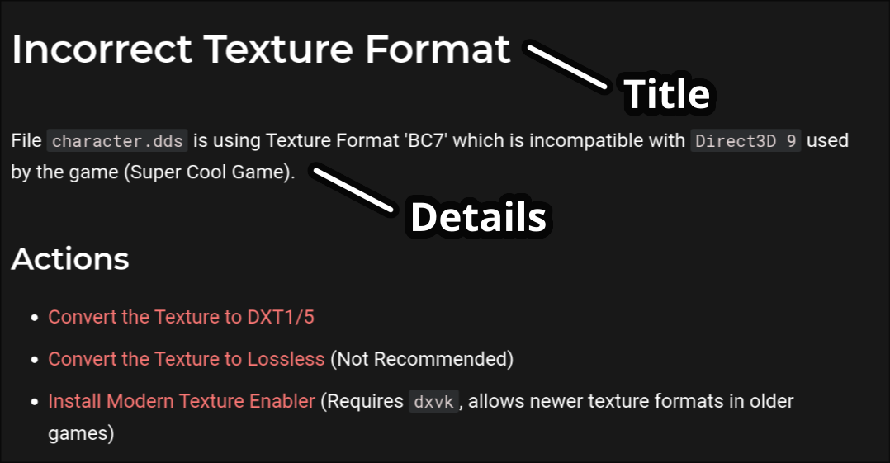

# Diagnostics

!!! info "The Diagnostic system is designed to inform the frontend (Mod Manager) about issues with the user's setup."

Conceptually, it's similar to the issues and suggestions you get in your code editor.

<figure markdown="span">
  
  <figcaption>Problems View in <a href="https://www.jetbrains.com/rider/">Rider IDE</a></figcaption>
</figure>

## Diagnostic Summary

!!! tip "Represents the things you can see at a glance."

| Item                  | Description                                           |
| --------------------- | ----------------------------------------------------- |
| [Id](#id)             | Unique identifier for this diagnostic type.           |
| [Severity](#severity) | How critical this diagnostic is. (Info/Warning/Error) |
| [Summary](#summary)   | One sentence describing the issue.                    |

<figure markdown="span">
  
  <figcaption>Annotated version of previous image.</figcaption>
</figure>

### Id

!!! info "The unique 'type' of diagnostic shown."

    Examples:

    - `R3.S56.VFS-0A`: Error 10 from 'Virtual FileSystem' mod by S56.
    - `R3.S56.LOADER-ZZ`: Error 1296 from 'Reloaded 3 Loader' by S56.
    - `P5R.PM.ESSENTIALS-01`: Error 01 from 'Persona 5 (Royal) Essentials' by PM.
    - `GBFR.NK.ESSENTIALS-01`: Error 01 from 'Granblue Fantasy Relink' by NK.

!!! tip

    This is a human friendly unique identifier for a given diagnostic type. 

    Reloaded uses `hexatrigesimal` (base 36) for encoding the IDs i.e. `0-9` then `A-Z`.<br/>
    This allows for maximum of 1296 errors per source (category).

This is similar to .NET's [Compiler Errors][compiler-errors] where each error type has it's 
own Id, eg: `CS0027`.

Diagnostics use the format `{GameId}.{TeamId}.{ModName}-Index`.

- `{GameId}` is a 2-4 character identifier for your game.
- `{TeamId}` is a 2-4 character identifier for the group producing the diagnostic.
- `{ModName}` single word that represents the mod name.
- `{Index}` number of the diagnostic (starting from 0).

This can be represented in code by:

```rust
pub struct DiagnosticId 
{
    /// `{GameId}.{TeamId}.{ModName}`
    pub prefix: &'static str;

    /// Unique index for this diagnostic.
    pub diagnosticId: u16;
}
```

### Summary

!!! info "The Summary is a short one-sentence description of the diagnostic."

This is represented by a templated string:

```csharp
"Mod {ModA} will replace {ModB} at startup"
```

This string will be rendered on the UI and all fields will be populated with values.<br/>
This should be short enough to be 1 line when possible.

### Severity

!!! note "Severity levels allow users to gauge the importance of the diagnostic."

A diagnostic with a higher severity should be fixed first by the user.

| Severity                  | Description                                    |
| ------------------------- | ---------------------------------------------- |
| [Suggestion](#suggestion) | Showing helpful advice to the user.            |
| [Warning](#warning)       | Something that has unintended negative effect. |
| [Critical](#critical)     | Something that will break mod/game completely. |

#### Suggestion

!!! info "Something that doesn't indicate a problem, and offers improvements to the user."

    Examples:

    - Packing `{ModA}` into an archive will improve load times.
    - Converting textures in `{ModA}` to DDS will reduce memory usage and improve load times.
    - Debug logging is enabled for {ModA}, degrading performance.

This severity can be used to provide helpful advice to the user.

!!! warning "Applying these suggestions MUST NOT introduce further diagnostics of a higher severity."

These diagnostics MUST BE based on facts and not subjective (not personal opinion).

Suggestions have to be documented, and their improvements must be justifiable.
Don't offer improvements if you aren't sure that the user benefits from them.

#### Warning

!!! info "Something that has an unintended negative effect on any part of the game."

    Examples:

    - `{ModA}` will likely not work due to incompatibility with `{ModB}`.
    - `{ModA}`: `{FileA}` is missing texture(s), and will be replaced with default texture.
    - Your `{EXEFile}` EXE file is modified and may produce unexpected behaviour.

This severity encompasses unintended problems that negatively impact the game
in any of its aspects. This includes the visuals, the performance, and even the gameplay.

!!! tip "Sometimes Suggestions should be exposed as Warnings"

    For example in a 32-bit game that's limited to 2GiB of RAM, having non-DDS high quality textures 
    risks running out of memory.

    This should be reported as a warning, and if a crash is guaranteed, as an error.

#### Critical

!!! info "Something that will make the game unplayable."

    Examples:

    - You are missing a `{SpecialFile}` file, your game will likely crash.
    - `{ModA}` requires you have DLC installed. This will likely crash your game.

Unplayable, in this context, means that the user is unable to play the game.
For example, crashing the game.

The frequency or likelihood of such causes or conditions are irrelevant.

A crash that happens when the user starts the game, and a crash that happens
when the user is in a very specific situation, are equal in severity.

## Diagnostic Details

!!! tip "Represents the detailed information about a diagnostic."

| Item                | Description                                               |
| ------------------- | --------------------------------------------------------- |
| [Title](#title)     | Title for the full screen page displaying the diagnostic. |
| [Details](#details) | Full text of the diagnostic.                              |

<figure markdown="span">
  
  <figcaption>A mockup of 'details view'.</figcaption>
</figure>

### Title

!!! info "Page Title for the Diagnostic"

This title should not include the [diagnostic id](#id).

It should represent the title of the page containing the diagnostic information.

This title will be constant for every diagnostic of the same type.

### Details

!!! info "Basically the whole wiki page about the diagnostic."

While the [summary](#summary) limited to a sentence, the Details should actually explain the 
diagnostic and how the user might be able to fix it in depth.

```markdown
Mod {ModA} overwrites {FileA} from Mod {ModB}.
This will cause a runtime exception when loading the game.

You can fix this issue by not allowing {ModA} to overwrite {FileA}.
```

The `Details` are written in Markdown.

## Fixes

!!! info "Some Diagnostics May Offer Automated Fixes"

    Example:

    - Convert this texture to newer format.
    - Archive the mod for better load times.

Some rules apply when writing mod-fixes:

### Fixes should be non-destructive.

!!! info "Any change done by a fix should be revertible."

This revert does not have to be 1 click.
The important condition is that the action does not lead to data loss.

For example, in the `Convert PNG Textures to DDS BC7` action, the conversion would not be lossless;
and a tiny amount of detail would be lost. If the user performed this action without understanding
the implications, they could lose their lossless copies of the textures. We want to avoid that.

In a situation like this, the code fix may make a copy of the old textures inside a 'temporary' folder.
If the user is satisfied with the result, they may then delete the temporary folder with the old
textures.

## Implementing Diagnostics

!!! info "The Diagnostics system relies on Plugins, which use C exports."

As the long term API of diagnostics is unclear, they should be initially implemented directly into 
the server.

(We don't 100% know what APIs we need till we start writing actual diagnostics)

After a while, and 3rd party mods are made, the existing used APIs could be stabilized, and the
diagnostics should be moved out to separate plugins which would be dynamically enabled. 

!!! tip "Diagnostic Plugins, just like mods and everything else are regular packages."

### Updated Diagnostics

!!! info "The current set of diagnostics results may be affected by the following events"

- `Mod Enabled`
    - Enabling a mod may activate a new diagnostic emitter.
        - This also applies to mods enabled transitively, as dependencies.
    - The enabled mod may enable a new diagnostic.

- `Mod Disabled`
    - Disabling a mod may disable a diagnostic emitter.
        - All diagnostics produced by it should be removed.
    - The diagnostics for disabled mod(s) should be cleared.

- `Profile Changed / Initialize`
    - Find all diagnostic emitters for enabled mods and run them.

<!-- Forked from: https://github.com/Nexus-Mods/NexusMods.App/blob/main/docs/development-guidelines/Diagnostics.md -->

[compiler-errors]: https://learn.microsoft.com/en-us/dotnet/csharp/misc/cs0027
[diagnostic-id]: https://github.com/Nexus-Mods/NexusMods.App/blob/main/src/Abstractions/NexusMods.Abstractions.Games.Diagnostics/DiagnosticId.cs