# Load Ordering

!!! warning "Conceptually Load Ordering is part of the Loader, but we do it in Server"

    This is for performance reasons.

    Doing this in loader means reading info for all packages, which could be expensive for
    users with 2000+ packages installed. (Especially on Network Storage or HDDs)

    Instead, we prepare and cache this on the server, which already has the info in memory
    and the loader does only what is needed.

    Doing this in server also allows for *better error handling*, and friendlier error
    feedback to the user.

!!! info "This page shows the rules used when ordering mods to be loaded."

!!! note "Mods loaded last are assumed to be of highest priority."

When the user launches the game, the loader will look at the user's load order and then
reorder & disable mods such that they meet dependency requirements.

These operations are done in the following order:

- Reorder Mods
- Destroy (Remove) Mods

## Dependencies Must be Loaded First

!!! info "If Mod A sets Dependency on Mod B, then Mod B must be loaded first."

Suppose the following load order.

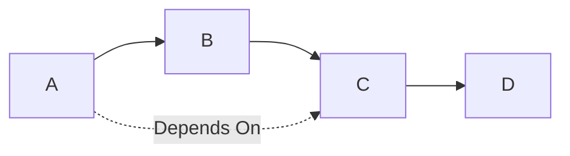

The mods must be arranged such that `ModC` is available by the time `ModA` is loaded.

i.e. The resulting load order should be...

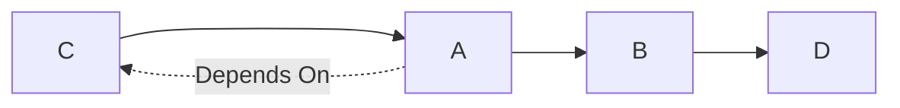

## Mods can Disable Incompatible Mods During Startup

!!! info "Mod A can mark Mod B as incompatible, leading to Mod B being disabled at startup."

!!! warning "Experimental"

    This is intended with the purpose of disabling mods in known guaranteed game-breaking scenarios.

!!! abstract "Log this as a warning."

Consider the following scenario:

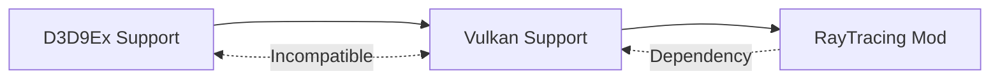

You have one mod which upgrades game to `Direct3D9Ex` and one that upgrades the game to `Vulkan`.

!!! question "You can only use one Graphics API at a time; so what happens?"

Proposed solution is to destruct the mod with the lower priority, in this case the `D3D9Ex` mod.

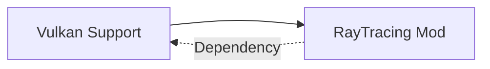

Additional Rationale:

- Incompatible mods may be implicitly loaded via dependencies with no way of user explicitly disabling them.

### Edge Case: Mod Dependency was Filtered Out

!!! danger

    In some cases destroying the mod with lower priority means that the dependencies of another mod are no longer
    resolvable.

!!! abstract "Display in MessageBox. Abort loading."

Consider the following:

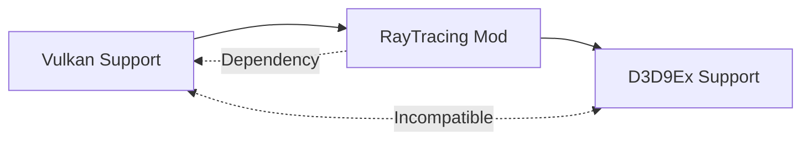

When `Vulkan Support` is filtered out due to being lower priority, the dependencies of `RayTracing Mod` are no longer
satisfied; thus game cannot be safely started.

To handle error case; simply check if all dependencies are satisfied after doing all operations.

### Edge Case: Recursive Incompatibility

!!! info "If Mod C disables Mod B which disables Mod A; Mod A should stay."

!!! abstract "Log this using 'info' level."

Consider the following:

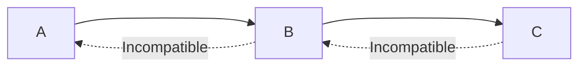

If higher priority `Mod C` marks `Mod B` as incompatible, `Mod A` can stay as it is no longer incompatible.

i.e. After removing items; this load order should be...

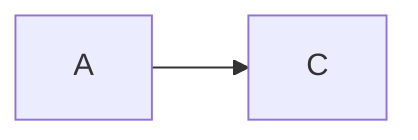

### Edge Case: Recursive Destruction With Dependency

!!! info

    If Mod C disables Mod B which depends on Mod A; **BUT** Mod A was not part of original group of mods to load, discard Mod A too.

!!! abstract "Log this under 'info' level."

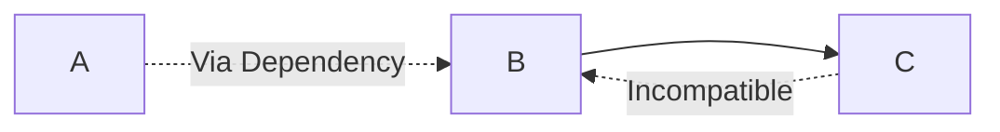

If mod B is removed, there is no longer reason to include Mod A; therefore it is removed.

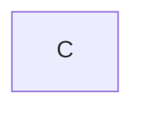

## Mods can Deprecate Other Mods by Overriding Dependencies

!!! info

    Mod A can mark Mod B as deprecated in the context of dependency resolution.
    In this case, all Dependencies to Mod A are re-routed to Mod B during the mod loading procedure.

!!! danger "Dangerous"

    This is intended to allow communities to pick up the work if a maintainer of one critical dependency goes missing;
    however risks the possibility of abuse. This should be seen as last resort.

!!! abstract "Log this as warning."

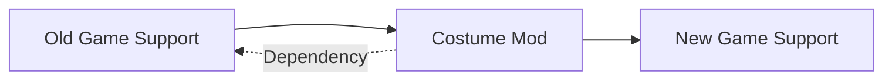

If Mod B declares itself as successor of Mod A [deprecates Mod A], dependencies to Mod A are rerouted to Mod B.

And since there is no longer a dependency on `Old Game Support`; the mod is excluded entirely.

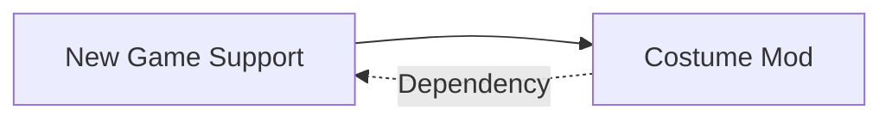