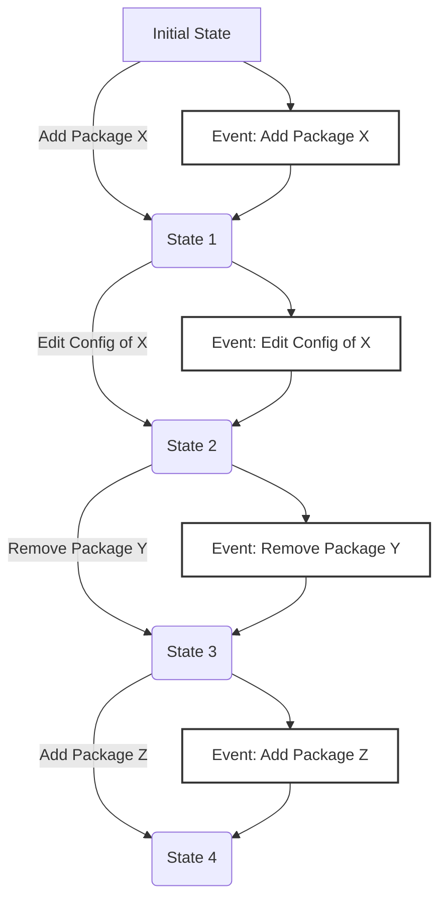

!!! info "Loadouts encapsulate a group of packages (Mods, Tools etc.) and their configurations."

A Loadout is a way to organize and manage a specific set of packages and their associated configurations.

!!! tip "Think of it like your `Create a Class` loadout in `Call of Booty`"

Loadouts allow you to experiment with different mod setups and configurations, with the ability
to switch between them on the fly.

## What a Loadout Contains

!!! tip "A Loadout consists of the following components"

- **Package List**: Historical metadata of packages used in the Loadout.
- **Package Configurations**: History of configuration settings for each mod in the Loadout.
- **Mod Configuration Schemas**: Files describing how mod configuration binary files are structured.

## Event Sourcing

!!! tip "Loadouts in Reloaded-III use the concept of 'events' to track and manage changes over time."

Event sourcing is a design pattern that represents the state of a system as a sequence of events.



Examples of events include:

- ***Set initial state***: Sets the initial state of a loadout.
- ***Adding a package***: This stores the package's metadata in the Loadout.
- ***Removing a package***: This removes the package's metadata from the Loadout.
- ***Editing a package's configuration***: This stores the new configuration settings for the package.

These events are stored in a sequential manner. This means that the Loadout can be reverted to any
previous state by "replaying" the events in order.

Additional benefits include:

- **History**: The event log is a complete history, enabling users to review past states and changes.
- **Efficiency**: Incremental changes use very little disk space.
- **Reproducibility**: You can reproduce the ***exact 1:1 state*** of the Loadout at any point in time.

## Sharing and Syncing Loadouts

!!! info "Loadouts in Reloaded-III are designed to be easily shared & synced across different devices or with other users."

Since Loadouts are represented as a sequence of events, they can be efficiently serialized and
stored in a compact format.

Loadouts just like pretty much everything else in Reloaded-III are packages. This means they can be
packed and downloaded by another user as a single file. The only caveat is they are stored outside
of the main `Packages` directory.

Loadouts can be shared with other users with or without historical data. If shared without historical data,
a 'snapshot' of the current state is created, and event history is trimmed to reduce the package size.

### Sync Methods

!!! info "Reloaded-III loadouts are intended to be share-able through the following methods"

- **1st Party Cloud Sync**: Basically something I self host for my people.
- **Game Store SaveData Sync**: e.g. Steam Cloud, GOG Galaxy SDK
- **Sharing as a Package**: Can be uploaded to a modding site, like any regular mod.
    - Other users can then import it by downloading it like a normal mod.
- **Cloud Sync**: GDrive, MEGA, Dropbox, etc.

!!! warning "The loadout packages must be FAST to pack and unpack."

    In order to minimize time spent on syncing. This (unfortunately) means
    we must avoid many small files in case of hard drives or network storage being used.

## Loadout File Format

!!! info "This details the nature of how Reloaded3 implements Event Sourcing for Loadouts"

| Item                                     | Path                                       | Description                                                                       |
| ---------------------------------------- | ------------------------------------------ | --------------------------------------------------------------------------------- |
| [Header](#headerbin)                     | `header.bin`                               | (Memory Mapped) Header with current loadout pointers. Facilitates 'transactions'. |
| [Events](#eventsbin)                     | `events.bin`                               | List of all emitted events in the loadout.                                        |
| [Commits](#commit-msgbin)                | `commit-msg.bin` & `commit-parameters.bin` | List of commit messages for each event.                                           |
| [Configs](#configbin)                    | `config.bin` & `config-data.bin`           | Package Configurations.                                                           |
| [Package Metadata](#package-metadatabin) | `package-metadata.bin`                     | Metadata required to restore all packages within this loadout.                    |

These files are deliberately set up in such a way that making a change in a loadout means appending
to the existing files. No data is overwritten. Rolling back in turn means truncating the files to the desired length.

In some cases, data is grouped to improve compression ratios by bundling similar data
together when sharing.

And in other cases, we put cold data that is infrequently accessed, e.g. `commit messages` in
a separate file as that information is rarely accessed.

### Loadout Storage & Lifetime

!!! info "Loadouts are stored as compressed Reloaded3 packages when inactive."

When a loadout is loaded, it is unpacked and memory mapped onto disk.

More specifically, we create memory mapped files and decompress the package contents into them.

This way, we can load loadouts with the latency of a memory mapped file while still maintaining
the ability to handle faults and crashes.

### Rolling Back a Loadout

!!! info "To roll back a Loadout to an earlier state, we replay the events from the start"

We 'replay' up to the event with the desired index.
As most events involve generating or unpacking a file, we can batch these operations, for example if:

- Event 1 is `Add Package X`
- Event 2 is `Add Package Y`
- Event 3 is `Remove Package X`

We can just extract the data for `Package Y` as Event 2 cancels itself out.
Processing the steps to be done from 0 to get to an earlier state is therefore a matter of milliseconds.

After that, we simply truncate the files. As every file works using the `Append` mechanism, we can just
truncate the file(s) to the required length. To do that, we keep track of entries that would normally
be written to each file as we replay the events, then truncate everything after where we ended up.

### Fault Handling

!!! info "How we handle crashes/errors."

In the event of a crash or power loss, we compare the packed version of the loadout with the unpacked
version. If the unpacked version contains invalid data, we discard it and reload the packed version.

If there was a power loss mid-write, there is a possibility the various files can contain data
that is unaccounted for. For example, a half persisted mod config. To handle this, we check the
[header.bin](#headerbin) file. If any of the content files have extra data, the file is trimmed to
the expected length.

### Snapshots

!!! note "Reloaded3 will not use snapshots."

It's expected an entire loadout could be replayed in milliseconds and there's also no good reason
to change the starting point of the history.

Loadouts shared with other people can simply have the whole history stripped if needed.

## Loadout Files

!!! info "This lists the binary file formats used by an unpacked loadout."

All bit packed fields are in little endian unless specified otherwise.
They are shown in lowest to highest bit order.

So an order like `u8`, and `u24` means 0:8 bits, then 8:32 bits.

### header.bin

!!! info "This is a master file which tracks the state of other files in the loadout."

This stores the version of the loadout and structure counts for remainder of the loadout files.

In the event of an unexpected crash, this file is used to determine the last state of the Loadout before
performing a cleanup of unused data (by truncating remaining files).

Format:

| Data Type | Name        | Description                                                   |
| --------- | ----------- | ------------------------------------------------------------- |
| `u16`     | Version     | Version of the loadout format.                                |
| `u16`     | Reserved    |                                                               |
| `u32`     | NumEvents   | Total number of events (and commit messages) in this loadout. |
| `u32`     | NumMetadata | Total number of package metadata files in this loadout.       |
| `u32`     | NumConfigs  | Total number of package configuration files in this loadout.  |

!!! warning "Backwards compatibility is supported but not forwards."

    If you're loading a `Version` that is newer than what you support, you should reject the file
    to avoid errors.

### events.bin

!!! info "This file contains all of the events that occurred in this loadout."

The number of events stored here is stored in [header.bin](#headerbin).

Each event uses the following format:

| Data Type | Name       | Description                                                                                                                  |
| --------- | ---------- | ---------------------------------------------------------------------------------------------------------------------------- |
| `u8`      | EventType  | Which kind of event was used.                                                                                                |
| `u56`     | InlineData | Information for event if the value is small enough to be stored in under 7 bytes. If not used, is set to `0xFFFFFFFFFFFFFF`. |

After the 8 byte header, there is the raw data for the event if the data can't be inlined.
The data formats for each event type are detailed below. Note that each event data always has to
be a multiple of 8 bytes to maintain alignment.

!!! note "`EventType` 0xF0 - 0xFF are 2 byte codes."

    This allows extending the total number of opcodes to 4336.

#### Optimizing Events

!!! tip "Sometimes events can be optimized."

For example, if a package is added and then immediately enabled, we can cancel out the events.

As the nature of the events is such that they are always appended, we don't do this during normal operation.
However, when we pack the loadout we will run certain clever optimizations like this to reduce clutter
and save space.

Situations where optimizations are applied at pack stage will be noted in the event's description.

#### Event List

The full list of events can be found on the [Event List Page][event-indexes].

### commit-msg.bin

!!! info "This contains the 'commit' messages for each event."

This file is stored separately from the main events as the commit messages are only ever used
when auditing history; and this is an infrequent operation.

This is an array of the following structure:

| Data Type                          | Name            | Description                                                             |
| ---------------------------------- | --------------- | ----------------------------------------------------------------------- |
| `u40` ([R3TimeStamp][max-numbers]) | TimeStamp       | Number of `10ms` ticks elapsed since `1st January 2024`. Max year 2111. |
| `u8`                               | NumParameters   | Number of parameters substituted into the template. (Max 256)           |
| `u18`                              | MessageTemplate | Index of message template. (Max 262144)                                 |
| `Parameter[NumParameters]`         | Parameters      | Parameters for the formatted string.                                    |

The `Parameter` struct is defined as:

| Data Type | Name            | Description                                                               |
| --------- | --------------- | ------------------------------------------------------------------------- |
| `u36`     | ParameterOffset | Offset of the parameter in [commit-parameters.bin](#commit-parametersbin) |
| `u20`     | ParameterLength | Length of the parameter data. (1MB Max)                                   |
| `u8`      | ParameterType   | Type of the parameter.                                                    |

`ParameterType` is defined as:

| Type | Data Type                          | Example               | Description                                                    |
| ---- | ---------------------------------- | --------------------- | -------------------------------------------------------------- |
| `0`  | `UTF-8 Char Array`                 | `Hello, World!`       | UTF-8 characters.                                              |
| `1`  | `u40` ([R3TimeStamp][max-numbers]) | `1st of January 2024` | Renders as human readable time.                                |
| `2`  | `u40` ([R3TimeStamp][max-numbers]) | `5 minutes ago`       | Renders as relative time.                                      |
| `3`  | `u0`                               | `1st of January 2024` | Human readable timestamp. Time sourced from message timestamp. |
| `4`  | `u0`                               | `5 minutes ago`       | Relative time. Time sourced from message timestamp.            |

Most messages will most likely contain 1 parameter. Thus be of size 8 (base) + 8 (1 `Parameter`).
Giving us ~16 bytes per message.

!!! note "Message parameters can be deduplicated."

    The writer maintains a hash of all parameters so far and reuses the same
    offset+length if the parameter ends up being a duplicate.

The `MessageTemplate` is a magic number that corresponds to a pre-formatted message.

The exact text for these messages are shipped in localisation files, such that they can appear
in a user's native language.

#### commit-parameters.bin

!!! tip "This is a raw buffer of UTF-8 characters."

The byte offset of each string and its length can be found in the [commit-msg.bin](#commit-msgbin) file.

!!! note "A timestamp is shown beside each event, it does not need to be embedded into description."

#### Message Template List

!!! info "Find the full list of templates on the [Commit Messages Page][commit-messages]."

### config.bin

!!! info "This stores all historical mod configurations for any point in time."

This is the array of `Config` structure, defined as:

| Data Type                          | Name        | Description                                                   |
| ---------------------------------- | ----------- | ------------------------------------------------------------- |
| `u28` [(MetadataIdx)][max-numbers] | MetadataIdx | Index of package metadata associated with this configuration. |
| `u4`                               | Reserved    |                                                               |
| `u32`                              | FileSize    | Size of the configuration file.                               |
| `u64`                              | FileOffset  | Offset of the configuration file.                             |
| `u64`                              | Hash        | Hash of the config ([XXH3][hashing]).                         |

Every config is appended to [config-data.bin](#config-databin) as it is added.

#### config-data.bin

!!! info "This is a buffer of raw, unmodified configuration files."

You can get the file size and offsets from the [config.bin](#configbin) file.

### package-metadata.bin

!!! info "This file contains a copy of the metadata for each package in the loadout's history."

In other words, a stripped down copy of each unique [Package.toml][package-toml] encountered.
This is stripped down to the absolute minimum information required to re-download the package
from the internet. i.e. It contains the `ModId`, `Version` and Update Sources.

It is generally expected for every file to be stored in here to be 1-3KB in size uncompressed.
Compressing it generally reduces it to 700-900 bytes standalone, and even more when in a SOLID
block like this.

#### What do we Store?

Below is an example in `.toml` with dummy data:

```
Id = "reloaded3.gamesupport.p5rpc.s56"
Name = "Persona 5 Royal Support"

[UpdateData]
[UpdateData.GameBanana]
ItemType = "Mod"
ItemId = 408376

[UpdateData.GitHub]
UserName = "Sewer56"
RepositoryName = "reloaded3.gamesupport.p5rpc"

[UpdateData.Nexus]
GameDomain = "persona5"
Id = 789012

[UpdateData.NuGet]
DefaultRepositoryUrls = ["http://packages.sewer56.moe:5000/v3/index.json"]
AllowUpdateFromAnyRepository = false
```

ID, Name and Update Sources to download the full package are stored. Rest is stripped.

We do custom binary serialization to store this info as efficiently as possible. Exact details to be
determined once the code is written.

#### How do we use this Data?

!!! info "Immediately download full package metadata from 1st party server."

Using this stripped down metadata, we download the full metadata package from the 1st party server
if the user does not have the full mod or full metadata available.

This full metadata package contains:

- Full [Package.toml][package-toml]
- Mod Configuration Schema
- All Gallery Images
- Full Documentation

It's expected each mod's package will probably be around 0.5MB - 3MB in size. Depending on the nature
of their gallery.

[commit-messages]: ./Commit-Messages.md
[event-indexes]: ./Events.md
[hashing]: ../../../Common/Hashing.md
[inline-data-sizes]: ../../../Common/Files.md#inline-data-sizes
[package-toml]: ../../Packaging/Package-Metadata.md
[root-level]: ../Locations.md#items-to-store
[max-numbers]: Events.md#max-numbers