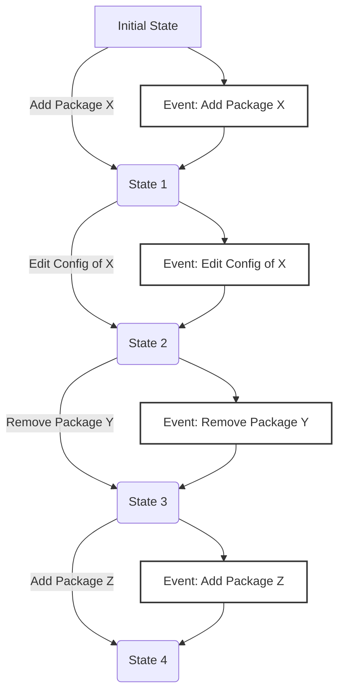

!!! info "Loadouts encapsulate a group of packages (Mods, Tools etc.) and their configurations."

A Loadout is a way to organize and manage a specific set of packages and their associated configurations.

!!! tip "Think of it like your `Create a Class` loadout in `Call of Booty`"

Loadouts allow you to experiment with different mod setups and configurations, with the ability
to switch between them on the fly.

## What a Loadout Contains

!!! tip "At a high level, a Loadout consists of the following components"

- **Package List**: Historical metadata of packages used in the Loadout.
- **Package Configurations**: History of configuration settings for each mod in the Loadout.
- **Mod Configuration Schemas**: Files describing how mod configuration binary files are structured.

For the exact contents, see [Snapshots][snapshot].

## Event Sourcing

!!! tip "Loadouts in Reloaded3 use the concept of 'events' to track and manage changes over time."

Event sourcing is a design pattern that represents the state of a system as a sequence of events.



Examples of events include:

- ***Set initial state***: Sets the initial state of a loadout.
- ***Adding a package***: This stores the package's metadata in the Loadout.
- ***Removing a package***: This removes the package's metadata from the Loadout.
- ***Editing a package's configuration***: This stores the new configuration settings for the package.

These events are stored in a sequential manner. This means that the Loadout can be reverted to any
previous state by "replaying" the events in order.

Additional benefits include:

- **History**: The event log is a complete history, enabling users to review past states and changes.
- **Efficiency**: Incremental changes use very little disk space.
- **Reproducibility**: You can reproduce the ***exact 1:1 state*** of the Loadout at any point in time.

## Sharing and Syncing Loadouts

!!! info "Loadouts in Reloaded3 are designed to be easily shared & synced across different devices or with other users."

Since Loadouts are represented as a sequence of events, they can be efficiently serialized and
stored in a compact format.

Loadouts just like pretty much everything else in Reloaded3 are packages. This means they can be
packed and downloaded by another user as a single file. The only caveat is they are stored outside
of the main [`Packages` directory][locations-packages].

Loadouts can be shared with other users with or without historical data. If shared without historical data,
it is distributed as a [snapshot][snapshot]; with stripped out event history is trimmed to reduce the package size.

### Sync Methods

!!! info "Reloaded3 loadouts are intended to be share-able through the following methods"

- **1st Party Cloud Sync**: Basically something I self host for my people.
- **Game Store SaveData Sync**: e.g. Steam Cloud, GOG Galaxy SDK
- **Sharing as a Package**: Can be uploaded to a modding site, like any regular mod.
    - Other users can then import it by downloading it like a normal mod.
- **Cloud Sync**: GDrive, MEGA, Dropbox, etc.

!!! warning "The loadout packages must be FAST to pack and unpack."

    In order to minimize time spent on syncing. This (unfortunately) means
    we must avoid many small files in case of hard drives or network storage being used.

## Loadout Storage and Lifetime

!!! info "Loadouts are stored as compressed Reloaded3 packages when inactive."

When a loadout is loaded, it is unpacked [from its packed state][packed] and memory mapped onto disk.

More specifically, we create memory mapped files and decompress the package contents into them.

This way, we can load loadouts with the latency of a memory mapped file (no need to wait till disk write)
while still maintaining the ability to handle faults and crashes.

## Rolling Back a Loadout

!!! info "To roll back a Loadout to an earlier state, we replay the events from the start"

We 'replay' up to the event with the desired index.
As most events involve generating or unpacking a file, we can batch these operations, for example if:

- Event 1 is `Add Package X`
- Event 2 is `Add Package Y`
- Event 3 is `Remove Package X`

We can just extract the data for `Package Y` as Event 2 cancels itself out.
Processing the steps to be done from 0 to get to an earlier state is therefore a matter of milliseconds.

After that, we simply truncate the files. As every file works using the `Append` mechanism, we can just
truncate the file(s) to the required length. To do that, we keep track of entries that would normally
be written to each file as we replay the events, then truncate everything after where we ended up.

## Fault Handling

!!! info "How we handle crashes/errors."

In the event of a crash, corrupt loadout or power loss, we have 3 sources of truth:

- [Packed Loadout][packed-loadout]
- [Unpacked Loadout][unpacked-loadout] (if Exists)
- [Snapshot][snapshot]

We restore the loadout using the newest of these sources.<br/>
This is determined by the [event count][event-count-header] field.

If the newest is a [packed][packed-loadout] or  loadout,
we simply replace the other 2 sources and we're done.

If the latest source however is a [snapshot][snapshot], we use that as a fallback and diff it against
the [packed][packed-loadout] or [unpacked][unpacked-loadout] version (whichever is newer). From there,
we auto-generate events to bring them up to date with the snapshot.

The snapshot does not store events, only the final state of the loadout; so this does mean that
timestamps will be lost, however; that is an acceptable trade-off given this is the last restort in
an error handling mechanism for handling potentially corrupt loadouts.

## Location

!!! info "For location of the `Loadouts` folder, see the [Locations][locations] page."

Loadouts are stored in the `Loadouts` folder.

```
Loadouts
├── 7f2cc8b7d9f1e3a5
│   └── ... unpacked files
├── 7f2cc8b7d9f1e3a5.nx
└── 7f2cc8b7d9f1e3a5.snapshot.bin
```

Each loadout has the following:

- An `.nx` binary file with [packed loadout data][packed-loadout-format].
- A `.snapshot.bin` [snapshot][snapshot] file, with last state in-memory state of unpacked loadout.
- A folder with [unpacked files][unpacked-format].

Each loadout is stored in an `.nx` archive, named `{UID}.nx` where `{UID}` is a randomly generated
64-bit integer.

When a loadout is loaded, it gets extracted to a folder named `{UID}` in the same folder as the `.nx`,
and the orignal `.nx` file is deleted.

[event-count-header]: ./File-Format/Unpacked.md#headerbin
[locations]: ../Locations.md
[locations-packages]: ../Locations.md#where-are-the-files-stored
[packed]: ./File-Format/Packed.md
[packed-loadout]: ./File-Format/Packed.md
[packed-loadout-format]: ./File-Format/Packed.md
[snapshot]: ./File-Format/Snapshot.md
[unpacked-format]: ./File-Format/Unpacked.md
[unpacked-loadout]: ./File-Format/Unpacked.md
[loadout-file-format]: ./File-Format/Unpacked.md