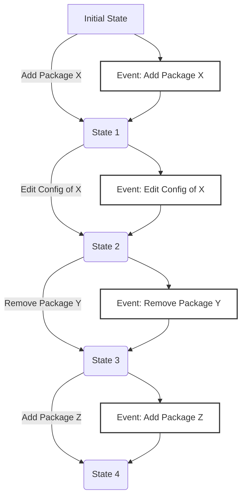

!!! info "Loadouts encapsulate a group of packages (Mods, Tools etc.) and their configurations."

A Loadout is a way to organize and manage a specific set of packages and their associated configurations.

!!! tip "Think of it like your `Create a Class` loadout in `Call of Booty`"

Loadouts allow you to experiment with different mod setups and configurations, with the ability
to switch between them on the fly.

## What a Loadout Contains

!!! tip "A Loadout consists of the following components"

- **Package List**: Historical metadata of packages used in the Loadout.
- **Package Configurations**: History of configuration settings for each mod in the Loadout.
- **Mod Configuration Schemas**: Files describing how mod configuration binary files are structured.

## Event Sourcing

!!! tip "Loadouts in Reloaded3 use the concept of 'events' to track and manage changes over time."

Event sourcing is a design pattern that represents the state of a system as a sequence of events.



Examples of events include:

- ***Set initial state***: Sets the initial state of a loadout.
- ***Adding a package***: This stores the package's metadata in the Loadout.
- ***Removing a package***: This removes the package's metadata from the Loadout.
- ***Editing a package's configuration***: This stores the new configuration settings for the package.

These events are stored in a sequential manner. This means that the Loadout can be reverted to any
previous state by "replaying" the events in order.

Additional benefits include:

- **History**: The event log is a complete history, enabling users to review past states and changes.
- **Efficiency**: Incremental changes use very little disk space.
- **Reproducibility**: You can reproduce the ***exact 1:1 state*** of the Loadout at any point in time.

## Sharing and Syncing Loadouts

!!! info "Loadouts in Reloaded3 are designed to be easily shared & synced across different devices or with other users."

Since Loadouts are represented as a sequence of events, they can be efficiently serialized and
stored in a compact format.

Loadouts just like pretty much everything else in Reloaded3 are packages. This means they can be
packed and downloaded by another user as a single file. The only caveat is they are stored outside
of the main `Packages` directory.

Loadouts can be shared with other users with or without historical data. If shared without historical data,
a 'snapshot' of the current state is created, and event history is trimmed to reduce the package size.

### Sync Methods

!!! info "Reloaded3 loadouts are intended to be share-able through the following methods"

- **1st Party Cloud Sync**: Basically something I self host for my people.
- **Game Store SaveData Sync**: e.g. Steam Cloud, GOG Galaxy SDK
- **Sharing as a Package**: Can be uploaded to a modding site, like any regular mod.
    - Other users can then import it by downloading it like a normal mod.
- **Cloud Sync**: GDrive, MEGA, Dropbox, etc.

!!! warning "The loadout packages must be FAST to pack and unpack."

    In order to minimize time spent on syncing. This (unfortunately) means
    we must avoid many small files in case of hard drives or network storage being used.

## Loadout File Format

!!! info "This details the nature of how Reloaded3 implements Event Sourcing for Loadouts"

| Item                                                     | Path                                                                        | Description                                                                       |
| -------------------------------------------------------- | --------------------------------------------------------------------------- | --------------------------------------------------------------------------------- |
| [Header](#headerbin)                                     | `header.bin`                                                                | (Memory Mapped) Header with current loadout pointers. Facilitates 'transactions'. |
| [Events](#eventsbin)                                     | `events.bin`                                                                | List of all emitted events in the loadout.                                        |
| [Timestamps](#timestampsbin)                             | `timestamps.bin`                                                            | Timestamps for each commit.                                                       |
| [Commit Parameters](#commit-parametersbin)               | `commit-parameters.bin`<br/>+ `commit-parameters-{x}.bin`                   | List of commit message parameters for each event.                                 |
| [Configs](#configbin)                                    | `config.bin`<br/>+ `config-data.bin`                                        | Package Configurations.                                                           |
| [Package Reference (IDs)](#package-references)           | `package-reference-ids.bin`                                                 | Hashes of package IDs in this loadout.                                            |
| [Package Reference (Versions)](#package-references)      | `package-reference-versions-len.bin`<br/>+ `package-reference-versions.bin` | String versions of package IDs in this loadout.                                   |
| [Store Manifests](#storesbin)                            | `stores.bin`<br/>+ `store-data.bin`                                         | Game store specific info to restore game to last version if possible.             |
| [Commandline Parameters](#commandline-parameter-databin) | `commandline-parameter-data.bin`                                            | Raw data for commandline parameters. Length specified in event.                   |

These files are deliberately set up in such a way that making a change in a loadout means appending
to the existing files. No data is overwritten. Rolling back in turn means truncating the files to the desired length.

In some cases, data is grouped to improve compression ratios by bundling similar data
together when sharing.

And in other cases, we put cold data that is infrequently accessed, e.g. `commit message` params in
a separate file as that information is rarely accessed.

### Loadout Storage & Lifetime

!!! info "Loadouts are stored as compressed Reloaded3 packages when inactive."

When a loadout is loaded, it is unpacked and memory mapped onto disk.

More specifically, we create memory mapped files and decompress the package contents into them.

This way, we can load loadouts with the latency of a memory mapped file while still maintaining
the ability to handle faults and crashes.

### Rolling Back a Loadout

!!! info "To roll back a Loadout to an earlier state, we replay the events from the start"

We 'replay' up to the event with the desired index.
As most events involve generating or unpacking a file, we can batch these operations, for example if:

- Event 1 is `Add Package X`
- Event 2 is `Add Package Y`
- Event 3 is `Remove Package X`

We can just extract the data for `Package Y` as Event 2 cancels itself out.
Processing the steps to be done from 0 to get to an earlier state is therefore a matter of milliseconds.

After that, we simply truncate the files. As every file works using the `Append` mechanism, we can just
truncate the file(s) to the required length. To do that, we keep track of entries that would normally
be written to each file as we replay the events, then truncate everything after where we ended up.

### Fault Handling

!!! info "How we handle crashes/errors."

In the event of a crash or power loss, we compare the packed version of the loadout with the unpacked
version. If the unpacked version contains invalid data, we discard it and reload the packed version.

If there was a power loss mid-write, there is a possibility the various files can contain data
that is unaccounted for. For example, a half persisted mod config. To handle this, we check the
[header.bin](#headerbin) file. If any of the content files have extra data, the file is trimmed to
the expected length.

### Snapshots

!!! note "Reloaded3 will not use snapshots."

It's expected an entire loadout could be replayed in milliseconds and there's also no good reason
to change the starting point of the history.

Loadouts shared with other people can simply have the whole history stripped if needed.

## Loadout Files

!!! info "This lists the binary file formats used by an unpacked loadout."

All values are in little endian unless specified otherwise.
They are shown in lowest to highest bit order.

So an order like `u8`, and `u24` means 0:8 bits, then 8:32 bits.

### header.bin

!!! info "This is a master file which tracks the state of other files in the loadout."

This stores the version of the loadout and structure counts for remainder of the loadout files.

In the event of an unexpected crash, this file is used to determine the last state of the Loadout before
performing a cleanup of unused data (by truncating remaining files).

Format:

| Data Type | Name            | Description                                                  |
| --------- | --------------- | ------------------------------------------------------------ |
| `u16`     | Version         | Version of the loadout format.                               |
| `u16`     | Reserved        |                                                              |
| `u32`     | NumEvents       | Total number of events and timestamps in this loadout.       |
| `u32`     | NumMetadata     | Total number of package metadata files in this loadout.      |
| `u32`     | NumConfigs      | Total number of package configuration files in this loadout. |
| `u32`     | NumGameVersions | Total number of game versions.                               |

!!! warning "Backwards compatibility is supported but not forwards."

    If you're loading a `Version` that is newer than what you support, you should reject the file
    to avoid errors.

### events.bin

!!! info "This file contains all of the events that occurred in this loadout."

Each event has a 1:1 mapping to a timestamp in [timestamps.bin](#timestampsbin).
The number of events stored here is stored in [header.bin](#headerbin).

!!! info "The event format is documented in the [Event List Page][event-indexes]."

As a summary. Each event is composed of an `u8` EventType and 0, 8, 24 or 56 bits of InlineData
(depending on `EventType`). Events are laid out such that they align with 8 byte boundaries.

Any data that doesn't fit in the `InlineData` field is stored in another file and loaded by index.
Details of that can be seen on each individual event entry.

#### Optimizing Events

!!! tip "Sometimes events can be optimized."

For example, if a package is added and then immediately enabled, we can cancel out the events.

As the nature of the events is such that they are always appended, we don't do this during normal operation.
However, when we pack the loadout we will run certain clever optimizations like this to reduce clutter
and save space.

Situations where optimizations are applied at pack stage will be noted in the event's description.

### timestamps.bin

!!! info "This contains the timestamp for each event."

!!! tip "Each timestamp here corresponds to an event in [events.bin](#eventsbin)."

This is an array of 32-bit timestamps ([R3TimeStamp[]][max-numbers]). The number of items is defined in
[header.bin](#headerbin).

### commit-parameters.bin

!!! tip "This file contains the parameters for any event that requires additional info in its commit message."

    The commit messages can usually be derived directly from the event.<br/>
    However, in some cases, additional information may be desireable to embed.

    For example, modifying a package configuration requires a description of the changes made.<br/>
    Because, we may not have the actual mod configuration metadata to determine what has changed.

    This file stores parameters for these rare cases.

!!! note "A timestamp is shown beside each event, it does not need to be embedded into description."

The `Parameter` struct is defined as:

| Data Type | Name            | Description                       |
| --------- | --------------- | --------------------------------- |
| `u8`      | ParameterType   | Type of the parameter.            |
| `u24`     | ParameterLength | Length of the parameter in bytes. |

`ParameterType` is defined as:

| Type | Data Type                          | Example                                 | Description                                                           |
| ---- | ---------------------------------- | --------------------------------------- | --------------------------------------------------------------------- |
| `0`  | `UTF-8 Char Array`                 | `Hello, World!`                         | UTF-8 characters.                                                     |
| `1`  | `u32` ([R3TimeStamp][max-numbers]) | `1st of January 2024`                   | Renders as human readable time.                                       |
| `2`  | `u32` ([R3TimeStamp][max-numbers]) | `5 minutes ago`                         | Renders as relative time.                                             |
| `3`  | `u0`                               | `1st of January 2024`                   | Human readable timestamp. Time sourced from message timestamp.        |
| `4`  | `u0`                               | `5 minutes ago`                         | Relative time. Time sourced from message timestamp.                   |
| `5`  | `BackReference`                    | 10 entries ago                          | Reference to a previous item. See [backreferences](#back-references). |
| `6`  | `List`                             | See [Parameter Lists](#parameter-lists) | Defines the start of a list. See [Parameter Lists](#parameter-lists). |

The parameter data is split into multiple files to aid compression:

- Text is expected to be mostly (English) ASCII and thus be mostly limited to a certain character set.
- Timestamps are expected to mostly be increasing.
- Other/Misc integers go in a separate file.
- Other/Misc floats go in a separate file.

Here is a listing of which parameter types go where:

| Type | Data Type                          | File                               |
| ---- | ---------------------------------- | ---------------------------------- |
| `0`  | `UTF-8 Char Array`                 | `commit-parameters-text.bin`       |
| `1`  | `u32` ([R3TimeStamp][max-numbers]) | `commit-parameters-timestamps.bin` |
| `2`  | `u32` ([R3TimeStamp][max-numbers]) | `commit-parameters-timestamps.bin` |

!!! note "Message parameters can be deduplicated."

    The writer maintains a hash of all parameters so far and reuses the same
    parameter index if the parameter ends up being a duplicate.

#### Back References

!!! info "Back References are a Special Type of Parameter that references a previous item."

This improves loadout sizes by reducing existing previous data.

| Data Type | Name            | Description                              |
| --------- | --------------- | ---------------------------------------- |
| `u8`      | ParameterType   | Type of the parameter.                   |
| `u24`     | ParameterOffset | Negative offset to referenced parameter. |

A `ParameterOffset` of `1` means 'the previous parameter'. `2` means 'the one before that' etc.

#### Parameter Lists

!!! info "This primitive is used when you have an unknown number of items."

Imagine you have a message which says:

```
Changes were made, here they are:

{ChangeList}
```

And you want `ChangeList` to have multiple items.

These items need to be localizable, for example a single `Change` item could be:

```
- Value **{Name}** changed to **{NewValue}**
```

This is where `Parameter Lists` come in.

A `Parameter List` is defined as:

| Data Type | Name          | Description                           |
| --------- | ------------- | ------------------------------------- |
| `u8`      | ParameterType | Type of the parameter.                |
| `u4`      | Version       | [Event Specific] version of the list. |
| `u20`     | NumParameters | Number of parameters.                 |

For the example above, we can treat each `Change` as 2 parameters.
In which case, if we had 2 changes, we would set `NumParameters` to `4`.

The individual parameters for `Name` and `NewValue` would then follow
as regular parameters in [commit-parameters.bin](#commit-parametersbin).

!!! question "Why is there a `Version` field?"

    Sometimes it may be desireable to change the structure.
    Suppose you wanted to change `Change` item to also have the previous value:

    ```
    - Value **{Name}** changed from **{OldValue}** to **{NewValue}**
    ```

    In order to perform this change, you would set the `Version` field to `1`.
    So when you read loadouts you can interpret both the old and new format side by side.

#### Message Template List

!!! info "Find the full list of templates on the [Commit Messages Page][commit-messages]."

### config.bin

!!! info "This stores all historical mod configurations for any point in time."

This is the array of file sizes, each being:

| Data Type | Name     | Description                     |
| --------- | -------- | ------------------------------- |
| `u16`     | FileSize | Size of the configuration file. |

Every new config is appended to [config-data.bin](#config-databin) as it is added.

Each unique config has an index, a.k.a. [ConfigIdx][max-numbers], which is an incrementing value from 0
every time a config is added. Emitted events refer to this index.

!!! question "How do you use this data?"

    When loading a loadout, calculate the offsets of each config in memory, by iterating through the
    `FileSize` field(s).

    - First config is at 0
    - Second is at 0 + `FileSize(first)`
    - Third is at `second` + `FileSize(second)`.

    etc. As you do this also, hash the configs. ([AHash][hashing] recommended)

    When a new config is created, hash it and check if it's a duplicate, if it isn't, add it to the
    config list.

#### config-data.bin

!!! info "This is a buffer of raw, unmodified configuration files."

You can get the file size and offsets from the [config.bin](#configbin) file.

### Package References

!!! info "A 'package reference' consists of a [XXH3(PackageID)][hashing] and Version."

    From [Package.toml][package-toml].

    This is the minimum amount of data required to uniquely identify a package.

Packages are referred to by an index known as [MetadataIdx][max-numbers] in the events.

So a `MetadataIdx == 1` means `fetch the entry at index 1` of [package-reference-ids.bin](#package-reference-idsbin)
and [package-reference-versions.bin](#package-reference-idsbin).

As for how to use the data, it is similar to [config.bin](#configbin), essentially we deduplicate
entries by in-memory hash. So an event can always refer to a [MetadataIdx][max-numbers] created
in an earlier event to save space.

!!! danger "Launcher MUST ensure each published mod has valid update/download data."

    Otherwise this system could fail, as a hash of packageID is not useful.

#### package-reference-ids.bin

!!! info "This is a buffer of [XXH3(PackageID)][hashing]"

    Each entry is 8 bytes long.

Using a 64-bit hash, we need around 5 billion hashes until we reach a 50% chance of collision,
that's quite plenty!

System can still always fail, we just pray it won't.

!!! note "Some Numbers"

    Nexus Mods alone hosts 815999 mods as of 30th of May 2024 (obtained via GraphQL API).

    The probability of a hash collision on whole mod set is roughly the following:

    ```python
    >>> r=815999
    >>> N=2**64
    >>> ratio = 2*N / r**2
    >>> ratio
    55407743.67551148
    >>> 1-math.exp(-1/ratio)
    1.8048018635141716e-08
    ```

    That ends up being ~0.0000018%
    I'll be damned if R3 comes anywhere close to that.

Anyway, assuming a more modest '100000' mods will be made in R3's lifetime, we can expect
a probability of 0.0000000027%, or more than 1 in 3.7 trillion.

If I'm ever *that* successful, I'd probably be funded enough that I could extend this to 128-bit hash,
and at that point a meteor is more likely to land on your house (no joke).

#### package-reference-versions-len.bin

Contains the lengths of entries in [package-reference-versions.bin](#package-reference-idsbin).

| Data Type | Name          | Description                 |
| --------- | ------------- | --------------------------- |
| `u8`      | VersionLength | Size of the Version string. |

!!! tip "This data compresses extremely well."

    Most versions are of form `X.Y.Z` so there is a lot of repetition of `05`.

#### package-reference-versions.bin

!!! info "This is a buffer consisting of package versions, whose length is defined in [package-reference.bin](#package-references)"

These versions are stored as UTF-8 strings. No null terminator.

!!! tip "This data compresses extremely well."

    Because the randomness (entropy) of values is low, the version components
    are super commonly 1s and 0s, and almost always all first two numbers `0-1` and dot `.`

#### Restoring Actual Package Files

!!! info "We follow a multi step process in order to reliably try restore Reloaded3 packages."

First we attempt to obtain full package metadata from [Central Server][central-server].

!!! failure "But what if [Central Server][central-server] is down?"

We will query the [Static CDN API][static-cdn-api].
That contains a dump of the latest package update info.

### stores.bin

!!! info "This stores all game store specific info."

!!! info "Why do we store this info?"

    This info can be used to identify the game when you share the loadout with a friend,
    and the game isn't known by the [Community Repository][community-repository].

    Or in the event that you cloud sync a game (between your machines) that's not known
    by the [Community Repository][community-repository].

    It can also be used to identify when game updates have taken place when auditing the log.

| Data Type                      | Name      | Description                              |
| ------------------------------ | --------- | ---------------------------------------- |
| `u8` [(StoreType)][store-type] | StoreType | The store from which the game came from. |
| `u16`                          | FileSize  | Size of the configuration file.          |
| `u8`                           |           | Currently Unused                         |

The offsets can be derived from file sizes.

Basically this contains data specific to game stores such as `GOG`, `Steam`, `Epic` etc. that can
be used to revert the game to an older version.

!!! warning "Reverting to earlier versions is not possible in all game stores."

#### store-data.bin

When values, e.g. strings are not available, they are encoded as 0 length strings, i.e. constant 00.

- `String8` is assumed to be a 1 byte length prefixed UTF-8 string.
- `String16` is assumed to be a 2 byte length prefixed UTF-8 string.

##### CommmonData Struct

!!! info "This struct is shared between all store entries."

i.e. This game was manually added.

| Data Type  | Name    | Description                                               |
| ---------- | ------- | --------------------------------------------------------- |
| `u64`      | ExeHash | The hash of the game executable (using [(XXH3)][hashing]) |
| `String16` | ExePath | The path to the game executable                           |
| `String8`  | AppId   | The application ID of the game                            |

We store this for every game, regardless of store.

##### Unknown

| Data Type    | Name       | Description                  |
| ------------ | ---------- | ---------------------------- |
| `u8`         | Version    | The version of the structure |
| `CommonData` | CommonData | The common data structure    |

##### Steam

| Data Type    | Name           | Description                                               |
| ------------ | -------------- | --------------------------------------------------------- |
| `u8`         | Version        | The version of the structure                              |
| `CommonData` | CommonData     | The common data structure                                 |
| `u64`        | AppId          | The Steam application ID                                  |
| `u64`        | DepotId        | The Steam depot ID                                        |
| `u64`        | ManifestId     | The Steam manifest ID                                     |
| `String8`    | Branch         | The Steam branch name                                     |
| `String8`    | BranchPassword | The password for the Steam branch (if password-protected) |

To perform rollback, will maintain basic minimal change fork of `DepotDownloader`,
no need to reinvent wheel. Manifest contains SHA checksums and
all file paths, we might be able to only do partial downloads.

To determine current version, check the App's `.acf` file in
`steamapps`. The `InstalledDepots` will give you the current
`Depot` and `Manifest` ID. Steam does not unfortunately have
user friendly version names.

To determine downloadable manifests, we'll probably have to use
`SteamKit2`. Use [DepotDownloader code][depot-downloader] for inspiration.

##### GOG

Extended details in [Stores: GOG][gog].

We can get the info from the registry at
`HKEY_LOCAL_MACHINE\Software\GOG.com\Games\{GameId}`

| Data Type    | Name        | Description                                         |
| ------------ | ----------- | --------------------------------------------------- |
| `u8`         | Version     | The version of the structure                        |
| `CommonData` | CommonData  | The common data structure                           |
| `u64`        | GameId      | The unique identifier for the game on GOG           |
| `u64`        | BuildId     | The [unique identifier for the build][gog-buildid]  |
| `String8`    | VersionName | The user-friendly version name for display purposes |

The `VersionName` is also copied into the commit message on each update.

To identify the version reliably, it seems we will need to compare the hashes against the ones in the different depots.

This will also allow us to support e.g. Heroic on Linux.

###### Heroic & Playnite

!!! note "These are 3rd party launchers that support GOG"

    They need to be supported, because there's no official Linux launcher.

!!! info "To be determined."

##### Epic

!!! warning "Version downgrade with Epic isn't possible."

    We will store the minimal amount of data required to identify the game in the hopes it is one day.

With Epic we can nip this data from `C:\Program Data\Epic\EpicGamesLauncher\Data\Manifests`.
We want the following:

| Data Type    | Name             | Description                                  |
| ------------ | ---------------- | -------------------------------------------- |
| `u8`         | Version          | The version of the structure                 |
| `CommonData` | CommonData       | The common data structure                    |
| `u128`       | CatalogItemId    | The MD5 hash identifier for the game on Epic |
| `String8`    | AppVersionString | The version string of the game on Epic       |

These values are directly extracted from the manifest file.

##### Microsoft

!!! warning "Version downgrade with Microsoft isn't possible."

    We will store the minimal amount of data required to identify the game in the hopes it is one day.

We're interested in `AppXManifest.xml` in this case.

| Data Type    | Name              | Description                                                                                                           |
| ------------ | ----------------- | --------------------------------------------------------------------------------------------------------------------- |
| `u8`         | Version           | The version of the structure                                                                                          |
| `CommonData` | CommonData        | The common data structure                                                                                             |
| `String8`    | PackageFamilyName | The unique identifier for the game on the Microsoft Store. [{Identity.Name}_{hash(Identity.Publisher)}][ms-store-pfm] |
| `String8`    | PackageVersion    | The version of the game package on the Microsoft Store, from `Identity` field.                                        |

The `PackageVersion` is actually a four part version, but is stored as string, so just in case an invalid
version exists in some manifest, we will string it.

#### commandline-parameter-data.bin

This file contains the raw strings for commandline parameters.
The lengths of the parameters are specified in the [UpdateCommandline event][update-command-line].

[commit-messages]: ./Commit-Messages.md
[event-indexes]: ./Events.md
[hashing]: ../../../Common/Hashing.md
[inline-data-sizes]: ../../../Common/Files.md#inline-data-sizes
[package-toml]: ../../Packaging/Package-Metadata.md
[root-level]: ../Locations.md#items-to-store
[max-numbers]: Events.md#max-numbers
[depot-downloader]: https://github.com/SteamRE/DepotDownloader/blob/b96125f9cbbb0f63d47e14784929f255f6c21ce1/DepotDownloader/ContentDownloader.cs#L185
[community-repository]: ../../../Services/Community-Repository.md
[store-type]: ./Events.md#storetype
[update-command-line]: ./Events.md#updatecommandline
[gog]: ./Stores/GOG.md
[ms-store-pfm]: ../../../Loader/Copy-Protection/Windows-MSStore.md
[gog-buildid]: ./Stores/GOG.md#retrieving-available-game-versions
[central-server]: ../../../Services/Central-Server.md
[static-cdn-api]: ../../../Services/Central-Server.md#static-cdn-api