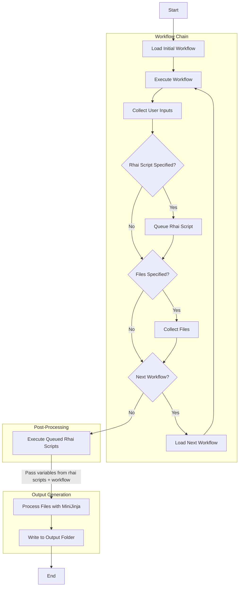

# Workflow Schema

!!! info "This file specifies the individual layout of a Reloaded3 workflow, including schema and supporting files."

## A Typical Workflow Package

!!! info "A typical package with workflows looks something like this."

```
reloaded3.workflow.sonicheroes.addacharacter.s56
├── languages
│   └── create-a-stage
│       ├── en-GB.toml
│       └── uwu-en.toml
├── package
│   └── images
│       ├── bingo_highway.jxl
│       ├── casino_icon.jxl
│       ├── casino_park.jxl
│       ├── city_icon.jxl
│       ├── egg_hawk.jxl
│       ├── grand_metrpolis.jxl
│       ├── ocean_palace.jxl
│       ├── power_plant.jxl
│       ├── robot_carnival.jxl
│       ├── seaside_hill.jxl
│       ├── seaside_icon.jxl
│       └── team_battle_1.jxl
├── workflows
│   └── create-a-stage
│       ├── files
│       │   └── package.toml
│       └── workflow.toml
└── package.toml
```

- Each workflow is stored in a subfolder of the `workflows` folder.
    - The `files` subfolder contains templates on which we perform [`substitution`][templates] on.
    - After `substitution`, the files are copied to the user's mod folder.
- The `languages` folder contains the localization files for each workflow.
- The `package/images` folder contains the images for each workflow (see [Packaging: Images][packaging-images] for more info).
- The [workflow.toml][workflow-toml] file defines the steps and metadata of the workflow.

## Workflow Execution Steps

!!! info "The workflow execution process in Reloaded3 is a multi-stage process"

The workflow execution process in Reloaded3 involves multiple stages, including running multiple
workflows in sequence, executing post-workflow scripts, and performing template substitutions.
Here's a detailed breakdown of the process:

1. **Workflow Chain Execution**
    - Start with the initial workflow.
    - For each workflow in the chain:

        1. Load the workflow configuration.
        2. Execute the workflow, collecting user inputs and generating output variables.
        3. If a [`rhai_script`][metadata-section] is specified, queue the script.
        4. If [`files`][metadata-section] are specified in the workflow, collect them into list.
        5. If a [`next_workflow_id`][next-workflow] is specified, run the next workflow.

    - Continue until there are no more workflows marked by `next_workflow_id`.

2. **Post-Workflow Script Execution**
    - For each `rhai_script` that was queued, in order:
        1. Load the associated Rhai script.
        2. Execute the script, providing access to all variables collected so far.
        3. Collect any new variables or modifications produced by the script.

3. **Template Substitution**
    - Collect all files specified in the `files` field of each executed workflow.
    - For each file:
        a. Load the file content.
        b. Use the MiniJinja engine to perform [variable substitutions][templates].
        c. Write the result to the output folder.

4. **Finalization**
    - Perform any final cleanup or organization of the output folder.
    - Notify the user of the completed workflow execution.

### Workflow Execution Graph



### Rhai Script Capabilities

Post-workflow Rhai scripts have several capabilities:

- Access to all variables collected throughout the workflow chain.
- Ability to modify existing variables in chain or create new ones.
- Perform file system operations (e.g., creating files/directories).
- Execute external commands or tools.

### MiniJinja Substitution

The MiniJinja engine performs the final substitution in specified files:

- All variables collected from workflows and Rhai scripts are available for substitution.
- Files can use Jinja2-style syntax for variable insertion and control structures.
- The engine processes each file, replacing placeholders with actual values.

This comprehensive workflow execution process allows for complex, multi-stage mod creation
workflows while maintaining flexibility and power through scripting and template substitution.

[workflow-toml]: ./Schema.md
[packaging-images]: ../../Packaging/About.md#images
[templates]: ./Templates.md
[scripting]: ./Scripting.md
[schema]: ./Schema.md
[next-workflow]: ./Schema.md#next-workflow
[metadata-section]: ./Schema.md#metadata-section