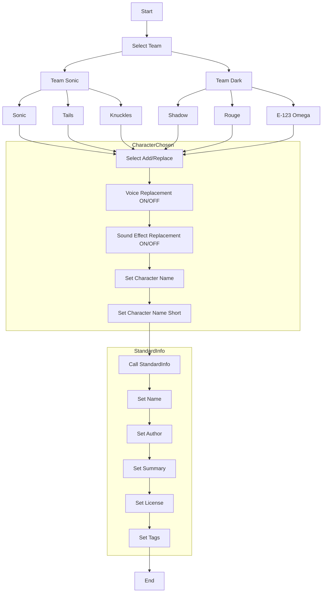

# Workflow Schema

!!! info "This file specifies the format of the `workflow.toml` files used to define workflow metadata and behaviour."

TODO: A way to run external tools in workflows.

TODO: 'Include' external file. e.g. 'Standard Workflow'

## Example File

!!! info "A typical `workflow.toml` has the following structure"

    I will use an imaginary workflow for changing a stage in `Sonic Heroes`
    as an example, as it can make good use of the required functionality.

### Workflow

```toml
[metadata]
format-version = 0
name = "WORKFLOW_NAME"
summary = "WORKFLOW_SUMMARY"
gameId = "sonicheroes"
version = "1.0.0"
author = "Sewer56"
files = [
    "files/package.toml",
]
language-subfolder = "create-a-character"
default_language = "en-GB.toml"

# Package id: sonicheroes.character.kaos.s56

# x Author [Special Variable] via Setting
# x Name via Setting
# x Summary via Setting
# x character_name [in ID] via Setting
# x character_name [Full] via Setting
# x license via Choice Setting
# x tags via Setting
# x allow 'extra tags' via Setting
# x add or replace via Selection

# A way to set dependencies between steps.
# A way to link the script to the workflow.
# A way to specify whether to replace voices.
# A way to specify whether to replace sound effects.

# Workflow Flow
# Brackets [ ] Indicate Groups, these should be shown together in UI.

# [EntryPoint]
# Select Add/Replace
#    if (add) goto CharacterChosen
#    if (replace) goto SelectTeam

# SelectTeam: ->
#     Select Character in Team ->
#     [Select Voice Replacement ON/OFF + Select Sound Effect Replacement ON/OFF] ->
#     goto CharacterChosen

# CharacterChosen:
#     [Set Character Name + Set Character Name (Short)] ->
#     call `StandardInfo` with `ExtraTags = ReplacedCharacterName`

# [Import from Standard] StandardInfo:
# Parameters: `ExtraTags`
# NOTE: Normally don't include details of 'Standard' in actual workflow file, this is just for demonstration.
#     [Set Name + Set Author + Set Summary + Set License + Set Tags] ->

[[settings]]
index = 0
type = "choice"
name = "SETTING_ADD_REPLACE"
description = "SETTING_ADD_REPLACE_DESC"
choices = ["SETTING_CHARACTER_ADD", "SETTING_CHARACTER_REPLACE"]
choice_images = ["shadow_icon.jxl", "rouge_icon.jxl", "omega_icon.jxl"]
variable = "selected_character"
style = "radio"

[[settings]]
index = 1
type = "choice"
name = "SETTING_TEAM"
description = "SETTING_TEAM_DESC"
choices = ["TEAM_SONIC", "TEAM_DARK"]
choice_images = ["team_sonic.jxl", "team_dark.jxl"]
variable = "selected_team"
style = "radio"

[[settings]]
index = 2
type = "choice"
name = "SETTING_CHARACTER"
description = "SETTING_CHARACTER_DESC"
choices = ["CHARACTER_SONIC", "CHARACTER_TAILS", "CHARACTER_KNUCKLES"]
choice_images = ["sonic_icon.jxl", "tails_icon.jxl", "knuckles_icon.jxl"]
variable = "selected_character"
style = "radio"

[[settings]]
index = 3
type = "choice"
name = "SETTING_CHARACTER"
description = "SETTING_CHARACTER_DESC"
choices = ["CHARACTER_SHADOW", "CHARACTER_ROUGE", "CHARACTER_OMEGA"]
choice_images = ["shadow_icon.jxl", "rouge_icon.jxl", "omega_icon.jxl"]
variable = "selected_character"
style = "radio"
```

!!! note "Some choices for team/character emitted for simplicity."



### Localization

!!! info "Workflows use the [Reloaded3 localization system][r3-localization-system]."

All user-facing text uses localization keys instead of direct text.

These keys will be resolved using the appropriate language file based on the user's settings.
Localization files should be placed in the [`languages` folder of the package][where-to-add-locales],
following the Reloaded3 localization file format. For example:

```toml
## languages/create-a-character/en-GB.toml
[[WORKFLOW_NAME]]
Change a Character

[[WORKFLOW_SUMMARY]]
Allows you to add or replace a character in the game.

# Select a Team
[[SETTING_TEAM]]
Select a Team

[[SETTING_TEAM_DESC]]
Which team is your character in?

[[TEAM_SONIC]]
Team Sonic

[[TEAM_DARK]]
Team Dark

# Select a Character
[[SETTING_CHARACTER]]
Select a Character

[[SETTING_CHARACTER_DESC]]
Choose a Character within your Chosen Team

[[CHARACTER_SONIC]]
Sonic

[[CHARACTER_TAILS]]
Tails

[[CHARACTER_KNUCKLES]]
Knuckles

[[CHARACTER_SHADOW]]
Shadow

[[CHARACTER_ROUGE]]
Rouge

[[CHARACTER_OMEGA]]
Omega

[[SETTING_CHARACTER_ADD]]
Adds a new character
```

The workflow system will use these localization keys to display text in the user's preferred language,
falling back to the default language if a translation is not available.

## Special Variables

!!! info "Some variables are 'special' and may have predetermined default values based on the environment."

## Metadata Section

The `[metadata]` section contains information about the workflow itself:

| Field                | Type   | Description                                                              |
| -------------------- | ------ | ------------------------------------------------------------------------ |
| `format-version`     | int    | The version of the workflow format. (Currently `0`)                      |
| `name`               | string | Localization key for the name of the workflow.                           |
| `summary`            | string | Localization key for the 1 line description summary.                     |
| [`gameId`][game-id]  | string | The [game][game-id] this workflow is for.                                |
| `version`            | string | The version of the workflow.                                             |
| `author`             | string | The (primary) author or group behind the workflow.                       |
| `files`              | string | The files where variable substitutions should be performed.              |
| `language-subfolder` | string | The name of the subfolder in the `languages` folder used for localizing. |
| `default_language`   | string | The default language file to use, relative to the `language_folder`.     |

!!! tip "The `language-subfolder` field is used when you're shipping multiple workflows within one package."

## Settings

!!! info "The `[[settings]]` entry defines [configuration settings][configuration-settings] for the package."

Each setting must specify a [`variable` name][configuration-settings-common-fields], for example:

```toml
[[settings]]
type = "choice"
name = "SETTING_CHARACTER"
description = "SETTING_CHARACTER_DESC"
choices = ["CHARACTER_SONIC", "CHARACTER_TAILS", "CHARACTER_KNUCKLES"]
default = "CHARACTER_SONIC"
variable = "selected_character"
```

The results of these settings are substituted into the package metadata.

The `[config]` section defines the configuration settings for the package:

[game-id]: ../../Storage/Games/About.md#id
[r3-localization-system]: ../../../Common/Localisation/About.md
[package-type]: ../../Packaging/Package-Metadata.md#packagetype
[is-dependency]: ../../Packaging/Package-Metadata.md#is-dependency
[configuration-settings]: ../../../Common/Configuration/Config-Schema.md
[configuration-settings-common-fields]: ../../../Common/Configuration/Config-Schema.md#common-setting-fields
[where-to-add-locales]: ../../../Common/Localisation/Adding-Localisations.md#where-to-add-localisations