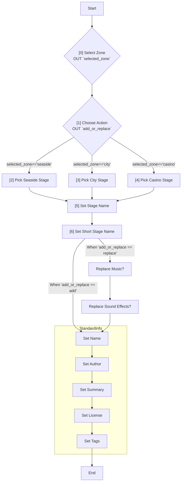

# Workflow Schema

!!! info "This file specifies the format of the `workflow.toml` files used to define workflow metadata and behaviour."

TODO: A way to run external tools in workflows.

TODO: 'Include' external file. e.g. 'Standard Workflow'

## Example File

!!! info "A typical `workflow.toml` has the following structure"

    I will use an imaginary workflow for creating or replacing a stage in `Sonic Heroes`
    as an example, as it can make good use of the required functionality.

### Workflow

```toml
[metadata]
id = "reloaded3.workflow.sonicheroes.createstage.s56"
format-version = 0
name = "WORKFLOW_NAME"
summary = "WORKFLOW_SUMMARY"
icon = "WORKFLOW_SUMMARY"
gameId = "sonicheroes"
version = "1.0.0"
author = "Sewer56"
files = [
    "files/package.toml",
]
language-subfolder = "create-a-stage"
default_language = "en-GB.toml"
next_workflow_id = "reloaded3.workflow.standard.createmod.s56"

[[settings]]
index = 0
type = "choice"
name = "SETTING_ZONE"
description = "SETTING_ZONE_DESC"
choices = ["ZONE_SEASIDE", "ZONE_CITY", "ZONE_CASINO"]
choice_images = ["seaside_zone.jxl", "city_zone.jxl", "casino_zone.jxl"]
variable = "selected_zone"
style = "radio"

[[settings]]
index = 1
type = "choice"
name = "SETTING_ADD_REPLACE"
description = "SETTING_ADD_REPLACE_DESC"
choices = ["SETTING_STAGE_ADD", "SETTING_STAGE_REPLACE"]
choice_images = ["add_icon.jxl", "replace_icon.jxl"]
variable = "add_or_replace"
style = "radio"
show_if = [
    { variable = "selected_zone", comparator = "!=", value = "" }
]

[[settings]]
index = 2
type = "choice"
name = "SETTING_SEASIDE_STAGE"
description = "SETTING_SEASIDE_STAGE_DESC"
choices = ["STAGE_SEASIDE_1", "STAGE_SEASIDE_2", "STAGE_SEASIDE_3"]
choice_images = ["seaside_hill.jxl", "ocean_palace.jxl", "egg_hawk.jxl"]
variable = "seaside_stage"
style = "dropdown"
show_if = [
    { variable = "selected_zone", comparator = "=", value = "ZONE_SEASIDE" }
]

[[settings]]
index = 3
type = "choice"
name = "SETTING_CITY_STAGE"
description = "SETTING_CITY_STAGE_DESC"
choices = ["STAGE_CITY_1", "STAGE_CITY_2", "STAGE_CITY_3"]
choice_images = ["grand_metropolis.jxl", "power_plant.jxl", "team_battle_1.jxl"]
variable = "city_stage"
style = "dropdown"
show_if = [
    { variable = "selected_zone", comparator = "=", value = "ZONE_CITY" }
]

[[settings]]
index = 4
type = "choice"
name = "SETTING_CASINO_STAGE"
description = "SETTING_CASINO_STAGE_DESC"
choices = ["STAGE_CASINO_1", "STAGE_CASINO_2", "STAGE_CASINO_3"]
choice_images = ["casino_park.jxl", "bingo_highway.jxl", "robot_carnival.jxl"]
variable = "casino_stage"
style = "dropdown"
show_if = [
    { variable = "selected_zone", comparator = "=", value = "ZONE_CASINO" }
]

[[settings]]
index = 5
type = "string"
name = "SETTING_STAGE_NAME"
description = "SETTING_STAGE_NAME_DESC"
default = ""
variable = "stage_name"
show_if = [
    { variable = "add_or_replace", comparator = "!=", value = "" },
    { variable = "selected_zone", comparator = "!=", value = "" }
]

[[settings]]
index = 6
type = "string"
name = "SETTING_STAGE_SHORT_NAME"
description = "SETTING_STAGE_SHORT_NAME_DESC"
default = ""
variable = "stage_short_name"
show_if = [
    { variable = "stage_name", comparator = "!=", value = "" }
]

[[settings]]
index = 7
type = "bool"
name = "SETTING_REPLACE_MUSIC"
description = "SETTING_REPLACE_MUSIC_DESC"
default = false
variable = "replace_music"
show_if = [
    { variable = "add_or_replace", comparator = "=", value = "SETTING_STAGE_REPLACE" },
    { variable = "stage_short_name", comparator = "!=", value = "" }
]

[[settings]]
index = 8
type = "bool"
name = "SETTING_REPLACE_SFX"
description = "SETTING_REPLACE_SFX_DESC"
default = false
variable = "replace_sfx"
show_if = [
    { variable = "replace_music", comparator = "=", value = "true" }
]
```

!!! note "Some choices for zone/stage emitted for simplicity."



The `◇ diamonds` in the flowchart represent selections which lead to different paths
later in the workflow.

### Localization

!!! info "Workflows use the [Reloaded3 localization system][r3-localization-system]."

All user-facing text uses localization keys instead of direct text.

These keys will be resolved using the appropriate language file based on the user's settings.
Localization files should be placed in the [`languages` folder of the package][where-to-add-locales],
following the Reloaded3 localization file format. For example:

```toml
## languages/create-a-stage/en-GB.toml

[[WORKFLOW_NAME]]
Create or Replace a Stage

[[WORKFLOW_SUMMARY]]
Allows you to add a new stage or replace an existing stage in the game.

# Select a Zone
[[SETTING_ZONE]]
Select a Zone

[[SETTING_ZONE_DESC]]
Which zone do you want to work with?

[[ZONE_SEASIDE]]
Seaside Zone

[[ZONE_CITY]]
City Zone

[[ZONE_CASINO]]
Casino Zone

# Select Add or Replace
[[SETTING_ADD_REPLACE]]
Select Action

[[SETTING_ADD_REPLACE_DESC]]
Choose whether to add a new stage or replace an existing one

[[SETTING_STAGE_ADD]]
Add New Stage

[[SETTING_STAGE_REPLACE]]
Replace Existing Stage

# Select a Stage (for each zone)
[[SETTING_SEASIDE_STAGE]]
Select Seaside Stage

[[SETTING_SEASIDE_STAGE_DESC]]
Choose which Seaside Zone stage you want to replace

[[SETTING_CITY_STAGE]]
Select City Stage

[[SETTING_CITY_STAGE_DESC]]
Choose which City Zone stage you want to replace

[[SETTING_CASINO_STAGE]]
Select Casino Stage

[[SETTING_CASINO_STAGE_DESC]]
Choose which Casino Zone stage you want to replace

[[STAGE_SEASIDE_1]]
Seaside Hill

[[STAGE_SEASIDE_2]]
Ocean Palace

[[STAGE_SEASIDE_3]]
Egg Hawk

[[STAGE_CITY_1]]
Grand Metropolis

[[STAGE_CITY_2]]
Power Plant

[[STAGE_CITY_3]]
Team Battle 1

[[STAGE_CASINO_1]]
Casino Park

[[STAGE_CASINO_2]]
Bingo Highway

[[STAGE_CASINO_3]]
Robot Carnival

# Stage Details
[[SETTING_STAGE_NAME]]
Stage Name

[[SETTING_STAGE_NAME_DESC]]
Enter the full name for your new or replacement stage

[[SETTING_STAGE_SHORT_NAME]]
Short Stage Name

[[SETTING_STAGE_SHORT_NAME_DESC]]
Enter a short name or abbreviation for your stage (used in some UI elements)

# Replacement Options
[[SETTING_REPLACE_MUSIC]]
Replace Background Music

[[SETTING_REPLACE_MUSIC_DESC]]
Choose whether to replace the background music for this stage

[[SETTING_REPLACE_SFX]]
Replace Sound Effects

[[SETTING_REPLACE_SFX_DESC]]
Choose whether to replace the sound effects for this stage

# StandardInfo settings
[[SETTING_AUTHOR]]
Author

[[SETTING_AUTHOR_DESC]]
Enter the name of the stage creator

[[SETTING_SUMMARY]]
Stage Summary

[[SETTING_SUMMARY_DESC]]
Provide a brief description of your stage

[[SETTING_LICENSE]]
License

[[SETTING_LICENSE_DESC]]
Specify the license for your stage (e.g., CC BY-NC, All Rights Reserved)

[[SETTING_TAGS]]
Tags

[[SETTING_TAGS_DESC]]
Add relevant tags for your stage, separated by commas (e.g., fast, water, loops)
```

The workflow system will use these localization keys to display text in the user's preferred language,
falling back to the default language if a translation is not available.

## Special Variables

!!! info "Some variables are 'special' and may have predetermined default values based on the environment."

- `author`: Defaults to your user name (if available).

## Metadata Section

The `[metadata]` section contains information about the workflow itself:

| Field                | Type   | Description                                                              |
| -------------------- | ------ | ------------------------------------------------------------------------ |
| `id`                 | string | A unique identifier for the workflow.                                    |
| `format-version`     | int    | The version of the workflow format. (Currently `0`)                      |
| `name`               | string | Localization key for the name of the workflow.                           |
| `summary`            | string | Localization key for the 1 line description summary.                     |
| [`gameId`][game-id]  | string | The [game][game-id] this workflow is for.                                |
| `version`            | string | The version of the workflow.                                             |
| `author`             | string | The (primary) author or group behind the workflow.                       |
| `files`              | string | The files where variable substitutions should be performed.              |
| `language-subfolder` | string | The name of the subfolder in the `languages` folder used for localizing. |
| `default_language`   | string | The default language file to use, relative to the `language_folder`.     |
| `next_workflow_id`   | string | The ID of the next workflow to execute after this one completes.         |

!!! tip "The `language-subfolder` field is used when you're shipping multiple workflows within one package."

!!! tip "The `id` is used to reference other workflows within a workflow."

### Settings

!!! info "The `[[settings]]` entry defines [configuration settings][configuration-settings] for the package."

Each setting must specify a [`variable` name][configuration-settings-common-fields], for example:

```toml
[[settings]]
type = "choice"
name = "SETTING_STAGE"
description = "SETTING_STAGE_DESC"
choices = ["STAGE_SEASIDE_1", "STAGE_SEASIDE_2", "STAGE_SEASIDE_3"]
default = "STAGE_SEASIDE_1"
variable = "selected_stage"
```

The results of these settings are substituted into the package metadata.

### Next Workflow

!!! info "The [next_workflow_id](#metadata-section) field in the metadata section specifies the ID of the next workflow to run."

This field allows for daisy-chaining workflows.
The workflow execution system should be aware of all available workflows and be able to locate them
by their IDs.

Example:

```toml
[metadata]
# ... other metadata fields ...
next_workflow_id = "reloaded3.workflow.standard.createmod.s56"
```

This will run the `reloaded3.workflow.standard.createmod.s56` workflow after the current one; and
[before][workflow-execution-steps] the post scripts are ran for each workflow.

[game-id]: ../../Storage/Games/About.md#id
[r3-localization-system]: ../../../Common/Localisation/About.md
[package-type]: ../../Packaging/Package-Metadata.md#packagetype
[is-dependency]: ../../Packaging/Package-Metadata.md#is-dependency
[configuration-settings]: ../../../Common/Configuration/Config-Schema.md
[configuration-settings-common-fields]: ../../../Common/Configuration/Config-Schema.md#common-setting-fields
[where-to-add-locales]: ../../../Common/Localisation/Adding-Localisations.md#where-to-add-localisations
[workflow-execution-steps]: ./About.md#workflow-execution-steps