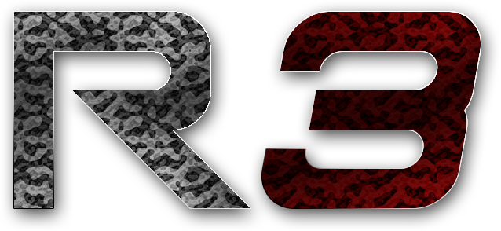

---
hide:
  - toc
---

!!! warning

    Extreme work in progress. We've only gotten started!

## What is Reloaded III

!!! info

    Reloaded III is a placeholder name; we're open for suggestions.

**[Reloaded III]** is a formal specification for an improved version of [Reloaded-II][reloaded-ii], a universal Game Modding framework.

	
	  

It is an ***extensible*** and ***modular*** framework that allows you to create your own mods for any game on virtually any platform.

R3 is built on a tried and tested architecture; that ensures games stay functional post updates, and ***good*** support for new games can be added ***fast***.

Don't waste time making a whole infrastructure for your game; *go mod stuff instead!*.

!!! question

    So what is Reloaded about? 👇 Below are some goals of the project.

## Mod Loader

<!-- Cards -->
<!--
	Icons: https://squidfunk.github.io/mkdocs-material/reference/icons-emojis/
	The dirty trick with images is we place them inline in text, let the page build
	and then copy the HTML out.

	I have no idea why MkDocs Material isn't properly handling icons in HTML out of the box.
-->

<!-- Portable & Modular -->
 <!-- Jinja2 Macro  -->

	{{ macros.card(
		"Svg/linux.svg",
		"Portable",
		"Supports a variety of platforms. Native x86, x64, Switch ARM, .NET 7+ etc."
	)}}

	{{ macros.card(
		"Svg/settings.svg",
		"Modular & Extensible",
		"Minimal core. Does nothing unnecessary. 
		All game modifications performed via mods."
	)}}

<!-- Rust/C# & Perf -->

	{{ macros.card(
		"Svg/language-csharp.svg",
		"Write Memory Safe Mods",
		"Fast development time with easy to learn C#. 
        Or Rust for wider platform support."
	)}}

	{{ macros.card(
		"Svg/speedometer.svg",
		"High Performance",
		"Lightweight and fast as fuck. 
		Optimized for <b>your CPU</b> and with PGO."
	)}}

<!-- Logging & Dependencies -->

	{{ macros.card(
		"Svg/book-heart-outline.svg",
		"Integrated Logging",
		"Logs to console and file in real time. 
		And perhaps with a universal mod, to the screen too!"
	)}}

	{{ macros.card(
		"Svg/package-dependencies-16.svg",
		"Dependency System",
		"Mods can set requirements on other mods. 
		The loader will ensure they're loaded before your mod."
	)}}

<!-- Early Hook & Hot Reload -->

	{{ macros.card(
		"Svg/run-fast.svg",
		"Early Hook",
		"Your code executes before the game 
		runs a single line of code."
	)}}

	{{ macros.card(
		"Svg/fire.svg",
		"Hot Reload",
		"Load & Unload supported mods at runtime. 
		Or even remotely, APIs available!"
	)}}

<!-- Debugging & Code Safety -->

	{{ macros.card(
		"Svg/debug-step-over.svg",
		"Debugging Support",
		"Debug &amp; Profile your code in Major IDEs 
		Including Edit &amp; Continue Support<a class=\"footnote-ref\" href=\"#fn:1\">1</a>."
	)}}

	{{ macros.card(
		"Svg/security.svg",
		"Library Conflict Safety",
		"Mods are stored and executed in isolation. 
		Use dynamically linked 3rd party libraries without worrying."
	)}}

<!-- Any Language, Any Game -->

	{{ macros.card(
		"Svg/code-tags.svg",
		"Use Any Language",
		"Can your language interop with C? 
		Congrats, you're 100% supported."
	)}}

	{{ macros.card(
		"Svg/gamepad-variant-outline.svg",
		"Add Mod Support Fast",
		"New game? Don't make a loader from scratch. 
		Your game engine might already have modules ready to go."
	)}}

<!-- Any Language, Any Game -->

    {{ macros.card(
		"Svg/book-open.svg",
		"Rich Documentation",
		"Writing mods should be easy! 
		Think <a href=\"https://reloaded-project.github.io/Reloaded-II/DevelopmentEnvironmentSetup/\">Reloaded II Docs</a> but for all languages."
	)}}

The goal is to create a world where modders can focus on actually *modding* the games.

## Mod Management & Packaging

!!! info

    Mod Managers implementing the R3 standard guarantee the following.

<!-- Clean Install & 1-Click -->

    {{ macros.card(
		"Svg/floppy.svg",
		"Clean Installation",
		"Doesn't modify game's existing files. 
		Self contained. Remove R3 folder and it's gone."
	)}}

	{{ macros.card(
		"Svg/desktop-download-24.svg",
		"1-Click Downloads",
		"Supports 1-click downloads on supported websites. 
        With backwards compatibility for games' legacy protocols."
	)}}

<!-- Dependency Resolution & Configuration -->

    {{ macros.card(
		"Svg/package-dependencies-16.svg",
		"Dependency Resolution",
		"If a mod requires another mod to function, 
		it will be automatically downloaded."
	)}}

	{{ macros.card(
		"Svg/update.svg",
		"Automatic Updates",
		"For everything: Launcher, Loader &amp; Mods. 
		Includes super cool <a href=\"https://reloaded-project.github.io/Reloaded-II/CreatingRelease/#add-delta-update\">Delta Update</a> technology."
	)}}

<!-- Multi-Game Launcher -->

	{{ macros.card(
		"Svg/settings.svg",
		"Built-in Mod Configuration",
		"Unified schema for configuring mods. 
        Works with any language; changes apply in real time!"
	)}}

    {{ macros.card(
		"Svg/gamepad-outline.svg",
		"Multi-Game Manager",
		"Supports multiple games at once. 
		Only one copy of Mod Manager needed."
	)}}

<!-- Installer -->

    {{ macros.card(
		"Svg/download-outline.svg",
		"Download From Anywhere",
		"Full support for various download sources, download and update! 
        GameBanana, Nexus, GitHub, NuGet and More!"
	)}}

## So What's the Idea?

!!! info

    This page looks [awfully familiar to Reloaded-II][reloaded-ii], what's up with that?

`Reloaded3` is a specification for an enhanced version of `Reloaded-II`; with a newer config schema,
design that supports multiple platforms (not just Windows) and the ability to allow anyone write mods in an arbitrary programming
language of their choice.

It expands the tried and tested Reloaded-II paradigm of having individual mods communicate with each other.

For example, support for specific games is implemented by talking to existing *other mods* which implement middleware/engine specific features for
archive formats, utility functions etc.

!!! tip

    Did you know the first mod for [Persona 3 on GameBanana][p3p-gamebanana] appeared
    ***40 minutes*** after the game released on PC?
    No changes were needed to Reloaded-II Launcher or Loader.

    This was possible because the game used `.cpk`, an archive format from
    [CRI Middleware][cri-middleware]; for which Reloaded had a [universal mod][universal-mod] to handle
    these archives without repacking.

    All the mod author had to do was set a `dependency` the mod and... that was all, it magically works!

## Feasible?

!!! question

    Whoa, whoa, whoa; isn't that a lot of stuff?
    Yeppers, the good news is; most of this stuff already exists in Reloaded-II 😉.

## Contributions

Contributions to this specification are **highly encouraged**; feel free to make corrections of any sort, and discuss issues as needed.

[^1]: For .NET you might need to set `COMPLUS_FORCEENC = 1` environment variable.

<!-- Links -->
[cri-middleware]: https://en.wikipedia.org/wiki/CRI_Middleware
[p3p-gamebanana]: https://gamebanana.com/games/16613
[reloaded-ii]: https://reloaded-project.github.io/Reloaded-II/
[universal-mod]: https://github.com/Sewer56/CriFs.V2.Hook.ReloadedII